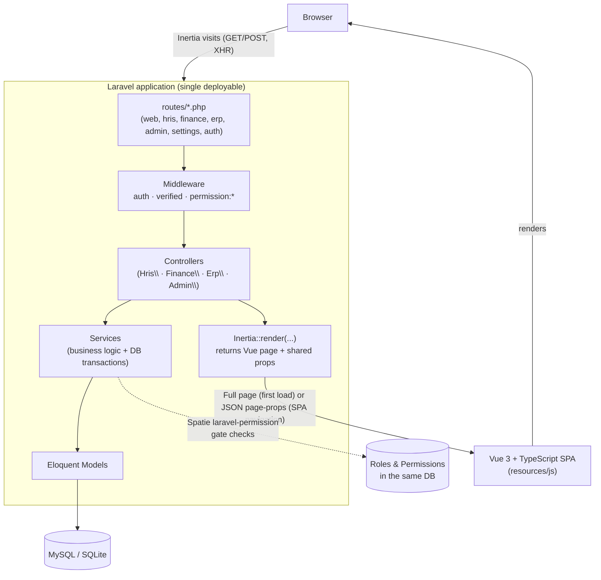
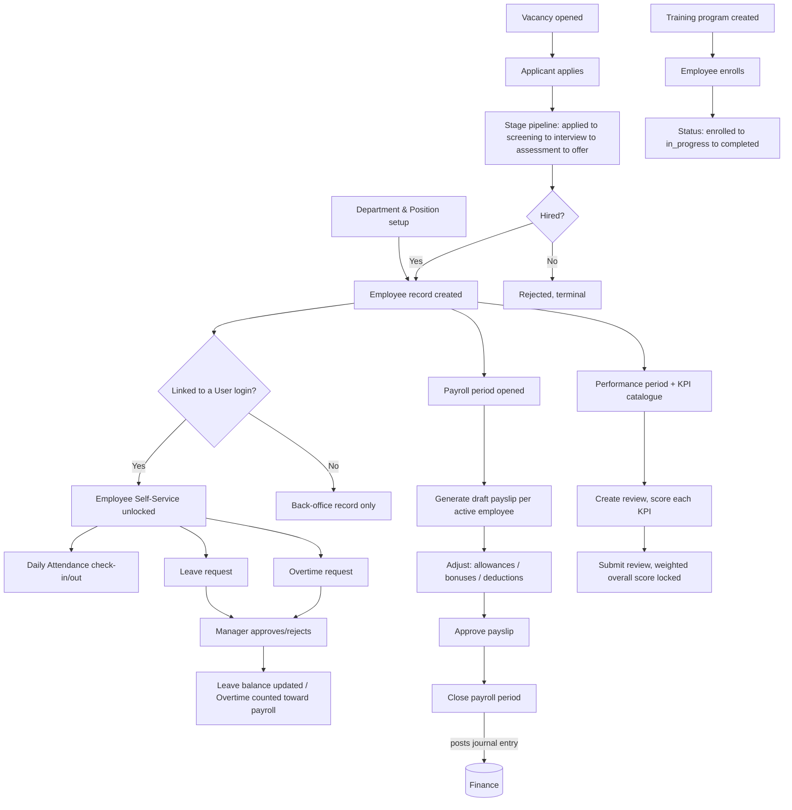
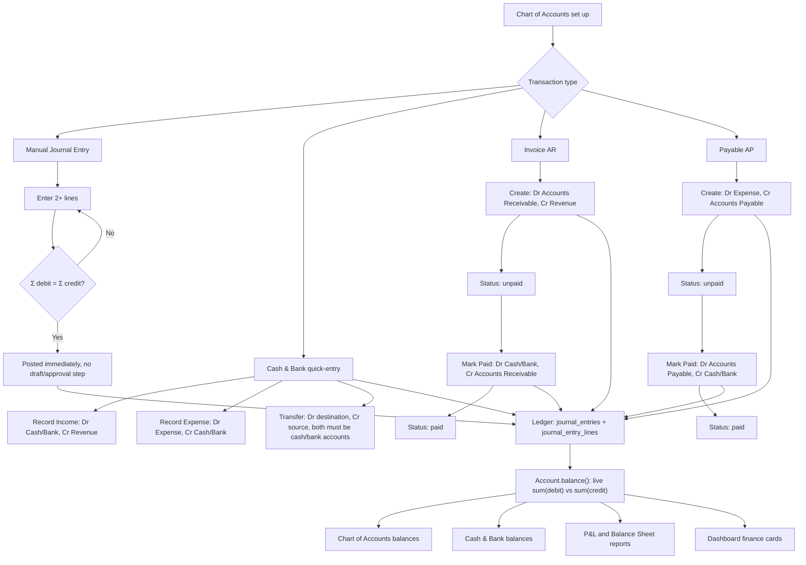
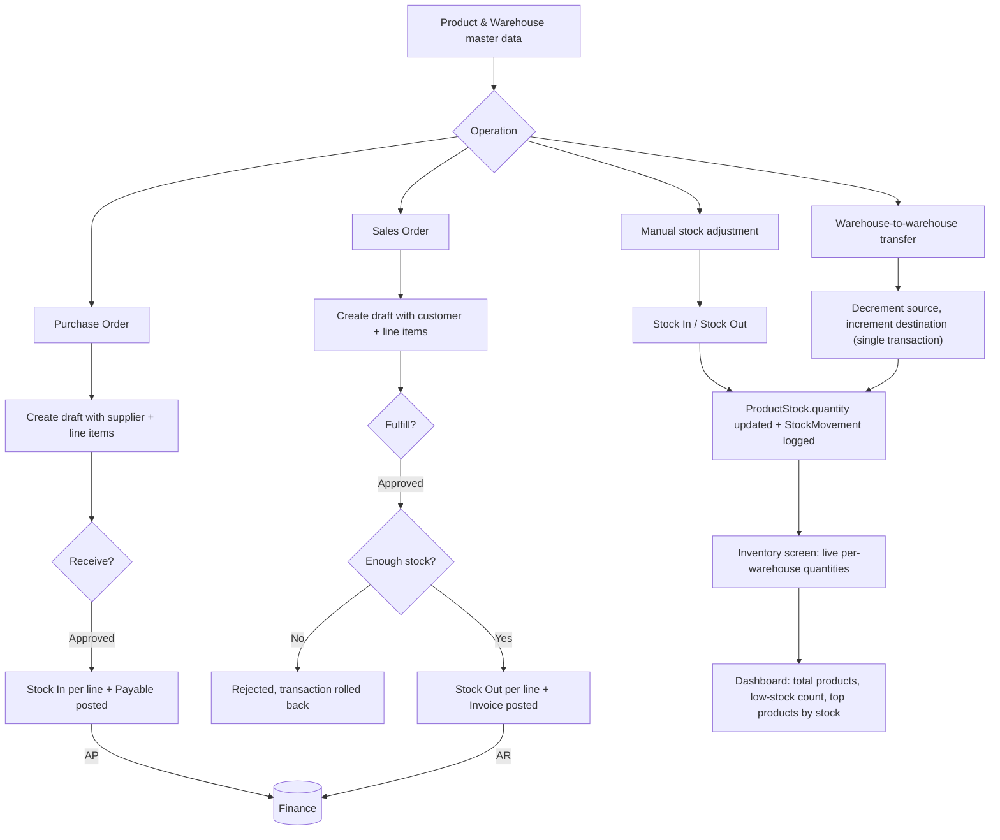
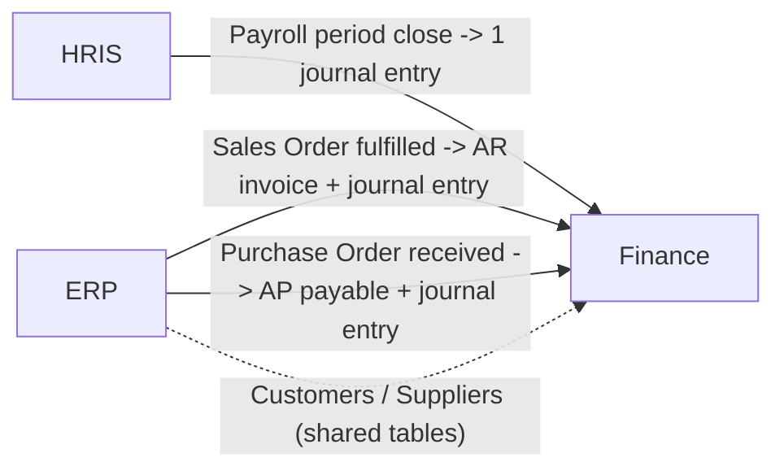

# MENTER

**HRIS · Finance · ERP, one integrated business platform.**

MENTER is a single Laravel + Inertia.js + Vue 3 application that runs Human Resources, Accounting, and basic Enterprise Resource Planning for a small/medium business out of one codebase and one database. An employee record, a journal entry, and a warehouse stock movement never turn into three separate systems that drift out of sync.

This README is the single source of truth for the project. It covers what exists, how the pieces fit together, and how to run, test, and extend it. Everything documented here was read directly from the source code, migrations, routes, and seeders, not assumed. Detailed reference material lives in [`docs/`](docs/) and is linked from the relevant section below.

---

## Table of Contents

1. [Overview](#1-overview)
2. [System Goals](#2-system-goals)
3. [Features](#3-features)
4. [System Architecture](#4-system-architecture)
5. [Modules](#5-modules)
6. [Technology Stack](#6-technology-stack)
7. [Project Structure](#7-project-structure)
8. [Database & ERD](#8-database--erd)
9. [HRIS Flow](#9-hris-flow)
10. [Finance Flow](#10-finance-flow)
11. [ERP Flow](#11-erp-flow)
12. [HRIS ↔ Finance ↔ ERP Integration](#12-hris--finance--erp-integration)
13. [Role & Permission](#13-role--permission)
14. [Role Action Flow](#14-role-action-flow)
15. [Business Process](#15-business-process)
16. [Authentication & Authorization](#16-authentication--authorization)
17. [Routes / API](#17-routes--api)
18. [Background Jobs / Events / Notifications](#18-background-jobs--events--notifications)
19. [Installation](#19-installation)
20. [Environment Configuration](#20-environment-configuration)
21. [Database Setup](#21-database-setup)
22. [Seeder / Initial Data](#22-seeder--initial-data)
23. [Running the Application](#23-running-the-application)
24. [Testing](#24-testing)
25. [Deployment](#25-deployment)
26. [Troubleshooting](#26-troubleshooting)
27. [Development Guidelines](#27-development-guidelines)
28. [Future Development](#28-future-development)
29. [Contribution Guidelines](#29-contribution-guidelines)

---

## 1. Overview

MENTER covers three business domains in one app:

- **HRIS**: employees, org structure, attendance, leave, overtime, payroll, KPIs, performance reviews, recruitment, training.
- **Finance**: chart of accounts, double-entry journal, cash & bank, accounts receivable (invoices) and accounts payable (payables), financial reports.
- **ERP**: products, warehouses, multi-warehouse inventory, suppliers, customers, purchase orders, sales orders.

The three domains aren't just grouped under one sidebar for looks. Closing a payroll period, fulfilling a sales order, and receiving a purchase order each **automatically post the correct accounting entry**, so nobody has to re-enter the same transaction into Finance by hand after it already happened in HRIS or ERP. See [§12](#12-hris--finance--erp-integration).

## 2. System Goals

These are read from what was actually built, not from a marketing brief:

- One login, one permission system, one database for HR, Accounting, and Inventory/Order operations.
- Every financial effect of an HR or ERP action (payroll, a fulfilled sale, a received purchase) is captured as a real, balanced, double-entry journal entry. Never a derived number bolted on afterward.
- Role-based access down to the individual action (view vs. create vs. approve) for every module.
- An audit trail for the sensitive Core/HRIS data: who changed what, and when (see [§8](#8-database--erd)).
- A demo-able system. One seed command produces a fully populated, realistic dataset across all three domains (see [§22](#22-seeder--initial-data)).

## 3. Features

Grouped by domain. Every item below has a corresponding controller/service and is reachable from the sidebar for a role with the right permission.

**HRIS**
- Employee records (with manager hierarchy, department/position, soft-delete)
- Department & position management
- Attendance: self-service check-in/check-out with a configurable grace period, company-wide log for managers
- Leave: request, approve/reject/cancel, per-employee-per-year balance tracking, unpaid-leave support
- Overtime: request, approve/reject/cancel, daily hour cap
- Payroll: open a period, generate payslips, adjust line items (allowance/bonus/deduction), approve, close the period
- KPIs & Performance Reviews: weighted KPI scoring per review period
- Recruitment: vacancies, applicants, a stage pipeline, interview notes, convert to employee
- Training: categories, programs, employee enrollment with completion tracking

**Finance**
- Chart of Accounts (asset/liability/equity/revenue/expense, with parent/sub-account support)
- Double-entry Journal Entries (manual, always validated to balance)
- Cash & Bank: live balances, income/expense quick-entry, inter-account transfer
- Invoices (AR) and Payables (AP): create, then mark paid; each posts its own journal entry
- Financial Reports: live Profit & Loss and Balance Sheet, computed from the ledger

**ERP**
- Products, Warehouses, multi-warehouse stock (`ProductStock`) with an append-only movement ledger (`StockMovement`)
- Manual stock adjustment (in/out) and inter-warehouse transfer, both concurrency-safe
- Suppliers & Customers (shared with Finance's AP/AR)
- Purchase Orders: draft, then receive (adds stock and posts a Payable)
- Sales Orders: draft, then fulfill (deducts stock and posts an Invoice)

**Platform**
- Role-based access control (9 roles, 63 permissions, see [§13](#13-role--permission))
- Audit log for Core/HRIS models ([§8](#8-database--erd))
- Cross-domain Dashboard with live charts (attendance trend, leave status breakdown, cash flow, stock levels)
- Searchable-combobox selects, password visibility toggles, dark mode

## 4. System Architecture



This is a classic **server-rendered SPA** (Inertia.js), not a decoupled API plus frontend. There's one deployable, the Vue app never talks to a separate JSON API, and there's no client-side router making REST calls. Every "page" is a Vue component rendered by Inertia from a Laravel controller response. See [§17](#17-routes--api) for why there's no `routes/api.php`.

## 5. Modules

| Domain | Sidebar section | Primary controllers | Primary services |
|---|---|---|---|
| Platform | Dashboard, Administration | `DashboardController`, `Admin\*` | *(none)* |
| HRIS | HRIS | `Hris\*` (14 controllers) | `AttendanceService`, `LeaveService`, `OvertimeService`, `PayrollService`, `PerformanceService`, `RecruitmentService` |
| Finance | Finance | `Finance\*` (6 controllers) | `JournalService`, `CashBankService`, `InvoiceService`, `PayableService` |
| ERP | ERP | `Erp\*` (7 controllers) | `InventoryService`, `PurchaseOrderService`, `SalesOrderService` |

Full file listing: [§7](#7-project-structure).

## 6. Technology Stack

| Layer | Technology |
|---|---|
| Backend framework | Laravel 12 (PHP ^8.2, developed against 8.3) |
| Server-side rendering bridge | Inertia.js 2.0 (`inertiajs/inertia-laravel`) |
| Frontend | Vue 3.5 (Composition API, `<script setup>`) + TypeScript |
| Build tool | Vite 6 |
| Styling | Tailwind CSS 3.4 + `tailwindcss-animate`, CSS-variable-based design tokens (emerald/slate theme, light and dark mode) |
| UI primitives | `radix-vue` (headless components like Dialog and Checkbox), `lucide-vue-next` (icons), `class-variance-authority` + `tailwind-merge` for variant styling |
| Route sharing | `tightenco/ziggy`. The `@routes` Blade directive inlines every named Laravel route into the page, so Vue components can call `route('finance.invoices.store')` the same way Blade would |
| Authorization | `spatie/laravel-permission` ^8.3 (roles and permissions, no custom Policy classes) |
| API tokens (installed, unused) | `laravel/sanctum` ^4.3 |
| Database | MySQL (dev/prod), SQLite in-memory for automated tests |
| Testing | PHPUnit 11 via `php artisan test` (Pest is present as a dev dependency of the starter kit, but every test is written as a PHPUnit `TestCase` class) |
| Code style | Laravel Pint (PHP), ESLint + Prettier (`prettier-plugin-tailwindcss`) for TS/Vue |
| Charts | Hand-built inline SVG Vue components (`resources/js/components/charts/`), no charting library dependency |

## 7. Project Structure

```text
app/
  Concerns/Auditable.php        # audit-log trait, mixed into ~23 models
  Enums/                        # status/type enums (AttendanceStatus, LeaveStatus, ...)
  Http/Controllers/
    Admin/                      # Users, Roles, Audit Log
    Auth/                       # Breeze/Fortify-style auth controllers (Laravel starter kit)
    Hris/                       # 14 controllers: employees, attendance, leave, overtime, payroll, kpis, performance, recruitment, training, departments, positions
    Finance/                    # 6 controllers: accounts, journal, cash & bank, invoices, payables, reports
    Erp/                        # 7 controllers: products, warehouses, inventory, suppliers, customers, purchase orders, sales orders
    Settings/                   # profile, password
    DashboardController.php
  Models/                       # ~38 Eloquent models, one per table (see docs/database.md)
  Services/                     # business logic; the only layer allowed to mutate financial/inventory state
database/
  migrations/                   # 46 migration files, chronologically ordered
  seeders/                      # one seeder per domain + DatabaseSeeder orchestrator
  factories/
resources/
  css/app.css                   # design tokens (CSS custom properties) + Tailwind layers
  js/
    pages/                      # one Vue file per Inertia route, mirrors routes/*.php structure
    layouts/                    # AppLayout (authenticated shell), AuthLayout (login/register)
    components/
      ui/                       # shadcn-vue-style primitives (Button, Input, Dialog, SearchableSelect, ...)
      charts/                   # TrendAreaChart, GroupedBarChart, HorizontalBarChart
routes/
  web.php                       # entry point; requires the files below
  hris.php  finance.php  erp.php  settings.php  auth.php
tests/
  Feature/{Admin,Auth,Erp,Finance,Hris,Settings}/
docs/                           # this file's detail pages (database, roles, business process, routes)
```

## 8. Database & ERD

Full entity-relationship diagrams (split by domain, since one diagram for all ~38 tables would be unreadable), every column, and the audit-trail coverage list:

**→ [docs/database.md](docs/database.md)**

Quick summary: Core/Auth (users, roles, permissions, audit log) feeds into HRIS (org structure, attendance, leave, payroll, performance, recruitment, training), Finance (accounts, journal, invoices, payables), and ERP (products, warehouses, stock, orders). The tables that physically cross domains are listed in [docs/database.md#cross-domain-foreign-keys](docs/database.md#cross-domain-foreign-keys).

## 9. HRIS Flow



A couple of things this flow deliberately does **not** cover: there's no dedicated resignation/termination workflow beyond setting `employment_status` on the employee record (the possible values come from the `EmploymentStatus` enum), and payroll doesn't currently deduct pay for unpaid leave taken. See [§28](#28-future-development).

## 10. Finance Flow



Who does what: an invoice or payable is **created** by Finance Staff or a Manager (`invoice.create` / `payable.manage`), but only a **Manager-level** permission (`invoice.approve` / `payable.manage`) can mark it paid. The exact permission-to-action mapping is in [§13](#13-role--permission). A manual journal entry has no separate approval step; creating it *is* posting it (`journal.approve` is seeded as a permission but not yet wired to any route, see [§28](#28-future-development)).

## 11. ERP Flow



Master data (`Product`, `Warehouse`, `Supplier`, `Customer`) has no approval workflow. Only the transactional documents (Purchase Order, Sales Order) go through a draft-then-approved-action state machine, and in both cases the "approval" (`purchase.approve` / `sales.approve`) is the same action that executes the operation (receive / fulfill). There's no separate "approve, then someone else executes" step.

## 12. HRIS ↔ Finance ↔ ERP Integration



This is the full picture. **There is no reverse flow** (Finance doesn't push data back into HRIS or ERP) and **no direct HRIS↔ERP link** at all. Full sequence diagrams (who calls what service, in what order, inside which transaction), the integration table (source, destination, data, trigger, mechanism), and the failure-handling model live here:

**→ [docs/business-process.md](docs/business-process.md)**

## 13. Role & Permission

9 roles, 29 permission modules, 63 permissions total, all defined in `database/seeders/RolePermissionSeeder.php`. Condensed view:

| Role | Full access to | Read-only / partial |
|---|---|---|
| Super Admin | Everything | *(none)* |
| HR Manager | Employees, Departments, Positions, Attendance, Leave, Overtime, KPIs, Performance, Recruitment, Training, Audit Log (view) | Users (view), Payroll (view + process, not approve) |
| HR Staff | *(none)* | Employee (view/create/update, no delete), Department/Position (view), Attendance (manage), Leave/Overtime (view/create, no approve), Training (view) |
| Finance Manager | Accounts, Journal, Cash & Bank, Income, Expense, Invoices, Payables | Reports (view), Payroll (view + approve) |
| Finance Staff | Cash & Bank, Income, Expense | Accounts (view), Journal (view/create), Invoices (view/create), Payables (view) |
| Warehouse Manager | Warehouses, Inventory | Products (view) |
| Purchasing Staff | *(none)* | Purchase Orders (view/create, no approve), Suppliers/Products/Inventory (view) |
| Sales Staff | *(none)* | Sales Orders (view/create, no approve), Customers/Products/Inventory (view) |
| Employee | *(none)* | Own Attendance/Leave/Overtime/Payroll/Training only (self-service) |

Full permission catalogue, the complete role × permission matrix, and per-role action-flow diagrams:

**→ [docs/roles-and-permissions.md](docs/roles-and-permissions.md)**

## 14. Role Action Flow

Every role's login-to-module-to-allowed-actions flow, including what each role is explicitly *denied*, is diagrammed in **[docs/roles-and-permissions.md#role-action-flows](docs/roles-and-permissions.md#role-action-flows)**.

## 15. Business Process

Step-by-step sequence diagrams for the four processes that matter most (Sales Order to Invoice, Purchase Order to Payable, Payroll close to Journal Entry, and Leave request to approval), plus how audit logging actually fires (a synchronous Eloquent-event trait, not a queue):

**→ [docs/business-process.md](docs/business-process.md)**

## 16. Authentication & Authorization

- **Authentication**: Laravel's session-based auth (the Vue starter kit's auth scaffold): login, registration, password reset, email verification, password confirmation. See `routes/auth.php` and `app/Http/Controllers/Auth/`.
- **Session storage**: database driver (`SESSION_DRIVER=database`).
- **Authorization**: `spatie/laravel-permission`. No custom Gate/Policy classes exist; every check is either the `permission:` route middleware or an inline `$request->user()->can('...')` in a controller. See [§13](#13-role--permission) for the full model, and [docs/roles-and-permissions.md](docs/roles-and-permissions.md) for why UI-level permission checks (hiding a button) are a convenience rather than the actual security boundary.
- **Shared frontend auth state**: the `HandleInertiaRequests` middleware shares `auth.user`, `auth.permissions` (a flat array), and `auth.roles` on every Inertia response. That's what Vue components read to decide what to render.
- **Self-service scoping**: an `Employee` role user doesn't get a *different* permission per record. The controller resolves `Auth::user()->employee` and scopes queries to that employee's `id`, so "Employee" permissions are visibility-limited by the same permission a manager has rather than by a separate ACL.

## 17. Routes / API

MENTER exposes **web routes only** (Inertia), not a JSON REST API. The complete route table, every URI, HTTP verb, route name, and the exact permission it requires, is here:

**→ [docs/routes.md](docs/routes.md)**

`laravel/sanctum` is installed and `User` has `HasApiTokens`, but no `routes/api.php` exists and nothing issues a token today (see [§28](#28-future-development)).

## 18. Background Jobs / Events / Notifications

**None are implemented.** `app/Jobs`, `app/Events`, `app/Listeners`, and `app/Notifications` don't exist in this codebase, and there are no `Console\Commands` beyond the framework default. `QUEUE_CONNECTION=database` and the `jobs` table are only present because they ship with the default Laravel skeleton; nothing dispatches a job.

Every "process" that might look like a background job (audit logging, payroll posting, invoice/payable creation) actually runs **synchronously inside the HTTP request**, wrapped in a `DB::transaction()`. See [docs/business-process.md#failure-handling--retries](docs/business-process.md#failure-handling--retries) for why that's a deliberate simplicity choice rather than a placeholder, and [§28](#28-future-development) for where a queue would first make sense: payroll generation at scale, if a company grows past a few hundred employees.

## 19. Installation

### Requirements

| Requirement | Version used in development | Notes |
|---|---|---|
| PHP | 8.3 | `composer.json` requires `^8.2` minimum |
| Composer | 2.x | |
| Node.js | 22.x | `^20` or `^22` recommended for Vite 6 |
| npm | 10.x | |
| Database | MySQL 8.x | SQLite is used automatically for tests only, see [§24](#24-testing) |

No Redis, no queue worker, and no external service is required to run the app (see [§18](#18-background-jobs--events--notifications)).

### Steps

```bash
git clone <repository-url>
cd hris-finance-erp

composer install
npm install

cp .env.example .env
php artisan key:generate

# Create the database first (see §21), then:
php artisan migrate --seed

npm run build
php artisan serve
```

Log in at the URL `php artisan serve` prints, using any account from [§22](#22-seeder--initial-data). The password is `password` for all of them.

## 20. Environment Configuration

Only the variables a developer actually needs to touch. The full list is in `.env.example`; **no real secrets are committed there** (every value is blank, a safe default, or `localhost`).

| Variable | Description | Required |
|---|---|---|
| `APP_NAME` | Displayed app name and browser title (currently `MENTER`) | Yes |
| `APP_ENV` | `local` / `production` | Yes |
| `APP_KEY` | Generated by `php artisan key:generate`, never set by hand | Yes |
| `APP_URL` | Base URL used for generated links (e.g. password reset emails) | Yes |
| `DB_CONNECTION` | `mysql` (default) | Yes |
| `DB_HOST`, `DB_PORT` | Database host/port | Yes |
| `DB_DATABASE` | Database name (`.env.example` ships `nexa`, an earlier project name; rename it freely, nothing in the code depends on it) | Yes |
| `DB_USERNAME`, `DB_PASSWORD` | Database credentials | Yes |
| `SESSION_DRIVER` | `database` (default), requires the `sessions` table created by the base migration | Yes |
| `QUEUE_CONNECTION` | `database` (default), present but unused, see [§18](#18-background-jobs--events--notifications) | Conditional |
| `MAIL_MAILER` | `log` in development (mail gets written to the log instead of sent) | Conditional |
| `VITE_APP_NAME` | Mirrors `APP_NAME` into the frontend build | Yes |

## 21. Database Setup

```bash
# Create an empty database matching your .env DB_DATABASE value, then:
php artisan migrate
```

46 migrations run in chronological order (see [docs/database.md](docs/database.md) for what each one creates). A few of them are intentional "add column to an existing table" migrations (`add_manager_id_to_departments_table`, `add_is_cash_bank_to_accounts_table`, `add_invoice_and_payable_links`, `add_journal_entry_id_to_payroll_periods_table`). They exist because the referenced table didn't exist yet when the base table was first created (see the note in [docs/database.md](docs/database.md#hris-domain)), not because of a later schema mistake.

## 22. Seeder / Initial Data

```bash
php artisan migrate --seed
# or, on an existing database:
php artisan db:seed
```

`DatabaseSeeder` runs, in this order: `RolePermissionSeeder`, then `HrisSeeder` (10 departments, 40 to 90 employees at 4 to 9 per department), `AttendanceSeeder` (20 weekdays of realistic present/late/absent history), `LeaveTypeSeeder`, `KpiSeeder`, `RecruitmentSeeder`, `TrainingSeeder`, **9 demo user accounts** (one per role), `LeaveRequestSeeder` (around 49 leave requests across 4 months, covering every status), `ChartOfAccountsSeeder` (15 accounts plus 6 months of income/expense journal history), and finally `ErpSeeder` (2 warehouses, 8 products with varied stock levels, 2 suppliers, 2 customers, 1 demo invoice, 1 demo payable).

**Demo accounts** (password `password` for all):

| Email | Role |
|---|---|
| `admin@nexa.test` | Super Admin |
| `hr.manager@nexa.test` | HR Manager |
| `hr.staff@nexa.test` | HR Staff |
| `finance.manager@nexa.test` | Finance Manager |
| `finance.staff@nexa.test` | Finance Staff |
| `warehouse.manager@nexa.test` | Warehouse Manager |
| `purchasing.staff@nexa.test` | Purchasing Staff |
| `sales.staff@nexa.test` | Sales Staff |
| `employee@nexa.test` | Employee |

`php artisan migrate:fresh --seed` drops and recreates everything. Use it whenever you want a clean, fully-populated demo dataset.

## 23. Running the Application

Development mode needs two processes running side by side, since Inertia's dev experience relies on Vite's HMR server alongside PHP:

```bash
php artisan serve      # Laravel dev server, defaults to http://127.0.0.1:8000
npm run dev             # Vite dev server with HMR
```

Production-style local run (single process, pre-built assets):

```bash
npm run build
php artisan serve
```

> **Windows/WSL note**: Vite's dev server binds to `[::1]` (IPv6 loopback) by default. If a headless browser or tool can't reach `http://localhost:5173`, either use the "production-style" run above or point the tool at `http://127.0.0.1:5173` explicitly after confirming Vite actually listens on IPv4 in your environment.

## 24. Testing

```bash
php artisan test
```

This runs the full PHPUnit suite (80 tests at the time of writing) across `tests/Feature/{Admin,Auth,Dashboard,Erp,Finance,Hris,Settings}`. Tests run against an **in-memory SQLite database**, so no separate test database setup is required.

Coverage is intentionally focused rather than exhaustive (see the testing philosophy in [§27](#27-development-guidelines)): each Service class gets 2 to 6 tests covering its core business rule, things like "an unbalanced journal entry is rejected", "fulfilling beyond available stock is rejected", or "closing a period posts a payroll journal entry", instead of trying to cover every edge case of every controller.

```bash
php artisan test --filter=JournalTest   # run one test class
vendor/bin/pint                          # PHP code style, should pass clean before committing
npm run format                           # Prettier, auto-formats resources/
npm run lint                             # ESLint --fix for TS/Vue
npm run build                            # also acts as a Vue/TypeScript compile check
```

These are the same four commands `lint.yml` and `tests.yml` run in CI (see [§25](#25-deployment)). Running them locally before pushing saves you a red check on the PR.

## 25. Deployment

**Continuous Integration** runs on GitHub Actions (`.github/workflows/`) on every push or PR to `main` or `develop`:

| Workflow | Steps |
|---|---|
| `tests.yml` | Set up PHP 8.4 and Node 22, `npm ci`, create a SQLite file, `composer install`, copy `.env`, `php artisan key:generate`, `php artisan ziggy:generate` (refreshes the TypeScript route types), `npm run build`, `./vendor/bin/phpunit` |
| `lint.yml` | Set up PHP 8.4, `composer install` and `npm install`, `vendor/bin/pint`, `npm run format`, `npm run lint` |

There's **no CD (automatic deployment) step**. Both workflows only verify the code; neither one deploys it. No Dockerfile or infrastructure-as-code is committed either, so getting the app onto an actual server is a manual process. A standard Laravel deployment applies:

```text
Development (local, SQLite for tests, MySQL for app)
   ↓
Build:   composer install --no-dev --optimize-autoloader
         npm ci && npm run build
   ↓
Release: php artisan migrate --force
         php artisan config:cache && php artisan route:cache && php artisan view:cache
   ↓
Serve:   Nginx/Apache + PHP-FPM, document root at /public
```

Notes specific to this app:

- No queue worker (e.g. Supervisor running `php artisan queue:work`) is needed, see [§18](#18-background-jobs--events--notifications).
- No Redis is required. Sessions and cache both default to the `database` driver.
- The build step (`npm run build`) has to run before every deploy. Inertia's root Blade view (`resources/views/app.blade.php`) reads the Vite manifest, and it'll throw a 500 if the manifest is missing and the dev server isn't running either.

## 26. Troubleshooting

```text
Problem:  "Vite manifest not found" error on any page
Cause:    npm run build was never run, and the Vite dev server isn't running either
Solution: Run `npm run build` for a production-style run, or `npm run dev` alongside
          `php artisan serve` for local development.
```

```text
Problem:  A page loads with no styling / blank body, only in an automated/headless browser
Cause:    Vite's dev server binds to [::1] (IPv6) by default; some headless environments
          can't resolve that
Solution: Stop the dev server, delete public/hot if present, run `npm run build`, and let
          Laravel serve the compiled assets from public/build instead.
```

```text
Problem:  Database connection failed
Cause:    .env DB_* values don't match a database that actually exists
Solution: Confirm DB_HOST, DB_PORT, DB_DATABASE, DB_USERNAME, DB_PASSWORD, and that the
          database itself was created before running `php artisan migrate`.
```

```text
Problem:  Creating an Invoice or Payable throws "No query results for model [Account]"
Cause:    InvoiceService/PayableService look up the Accounts Receivable (code 1300) and
          Accounts Payable (code 2100) accounts by their seeded code, and those need to exist.
Solution: Run `php artisan db:seed --class=ChartOfAccountsSeeder` (or a full `db:seed`)
          before using AR/AP features on a database that skipped seeding.
```

```text
Problem:  Fulfilling a Sales Order or receiving a Purchase Order fails validation
Cause:    Fulfilling checks live stock via InventoryService and rejects insufficient
          quantity; both also require at least one revenue/expense account of the right
          type to exist for the auto-posted Invoice/Payable.
Solution: Check stock levels on the Inventory screen, and confirm the Chart of Accounts
          has at least one `revenue` and one `expense` account.
```

```text
Problem:  A demo account can log in but sees an almost-empty Dashboard/sidebar
Cause:    That role genuinely has few permissions (Sales Staff, for example, has no
          Finance access at all). This is by design, not a bug. See §13.
Solution: Log in as a role with broader access (Super Admin, HR Manager, Finance
          Manager) to see the full picture, or check docs/roles-and-permissions.md
          for exactly what that role can see.
```

## 27. Development Guidelines

Conventions this codebase actually follows. Read these before adding a feature:

- **Business logic lives in `app/Services/*`, never in a controller.** Every service method that mutates state wraps its work in `DB::transaction()` and uses `lockForUpdate()` on rows it reads then writes (see `InventoryService`, `LeaveService`, or `PayrollService` for the pattern). Controllers validate the request, call one service method, and redirect or render. Nothing more.
- **Money is `decimal`, never `float`, in the database and in Eloquent casts.** Journal entry debit/credit, product price, payroll amounts: all `decimal:2`.
- **Double-entry is enforced in one place**, `JournalService::create()`. If a feature needs to post a financial transaction, it should call this service (directly, or through `InvoiceService`, `PayableService`, or `CashBankService`, which all wrap it) rather than inserting `journal_entries`/`journal_entry_lines` rows itself.
- **Cross-database date comparisons must use `whereDate()`**, not a raw `where('date', ...)`. The app runs on MySQL (a real `DATE` column, which truncates time) in development but SQLite (which stores whatever string was inserted) in tests, so a raw comparison that works on one can silently break on the other. This has bitten the project once already; don't reintroduce it.
- **Frontend permission checks are UX only.** Always add the matching `permission:` middleware (or `abort_unless`) on the server side. Never rely on a hidden button as the actual access control.
- **Keep tests lean.** 2 to 6 focused tests per service covering the actual business rule, not exhaustive coverage. That's an explicit project preference, not an oversight (see `tests/Feature/*`).
- **New selects use `SearchableSelect`** (`resources/js/components/ui/select/SearchableSelect.vue`), not the plain HTML `<select>`. Every existing page has already been converted.
- **Money/date formatting on the frontend** goes through `Intl.NumberFormat('id-ID', { style: 'currency', currency: 'IDR', ... })`. The app is Indonesian-Rupiah-denominated throughout, so don't introduce a second currency format.

## 28. Future Development

Split honestly between **Planned** (a clear, scoped next step) and **Limitation** (a known gap with no committed timeline):

**Planned**
- Wire `journal.approve` to an actual draft-then-approve workflow for manual journal entries (the permission is seeded but currently unused; journal entries post immediately on create).
- Bring the ERP domain (`Product`, `Warehouse`, `ProductStock`, `StockMovement`, `Supplier`, `Customer`, `PurchaseOrder`, `SalesOrder`) and Finance's AR/AP tables (`Invoice`, `Payable`) under the `Auditable` trait, matching Core/HRIS coverage.
- A REST API surface using the already-installed Sanctum, for a future mobile client or third-party integration.

**Limitations (known, not hidden)**
- No resignation/termination workflow beyond manually changing `employment_status`.
- Payroll doesn't deduct pay for unpaid leave taken in the period.
- No budget module, multi-currency support, or tax calculation anywhere in Finance.
- No background job/queue infrastructure is actually used, so payroll generation for a very large employee count runs synchronously inside one request. Fine at the current seeded scale of 40 to 90 employees; a queued job would make sense somewhere in the hundreds-to-thousands range.
- CI (GitHub Actions) verifies the code on every push, but there's no CD step, Dockerfile, or infrastructure-as-code, so deployment itself is still a manual process (see [§25](#25-deployment)).

## 29. Contribution Guidelines

This is a solo-developed portfolio/internal project without an external contribution process, but if you're extending it:

1. Follow the conventions in [§27](#27-development-guidelines), especially "business logic in Services" and "double-entry through `JournalService`".
2. Run `vendor/bin/pint`, `npm run lint`, and `php artisan test` before committing. All three should pass clean.
3. Keep new tests focused (2 to 6 per service) rather than exhaustive, matching the existing suite's style.
4. Update the relevant file under `docs/` (and this README's summary section) whenever a change adds or removes a route, permission, table, or cross-domain integration. The goal is for this documentation to never drift from the code that actually runs.
5. Never commit real credentials into `.env.example` or anywhere else in the repository.
