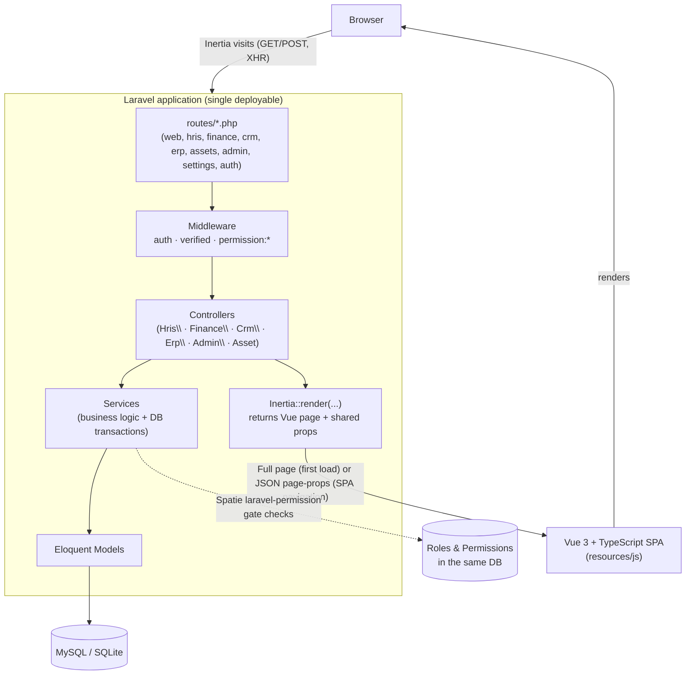
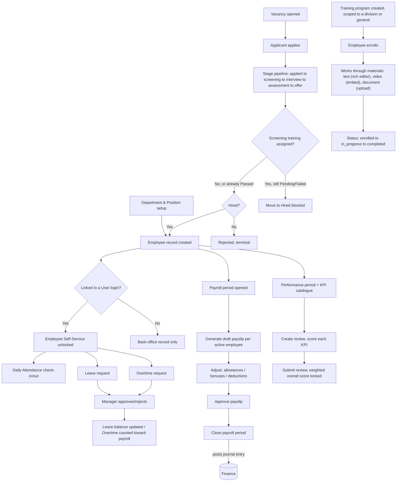
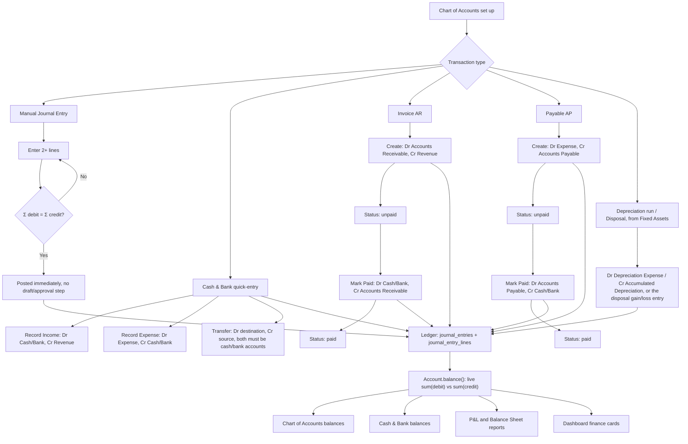
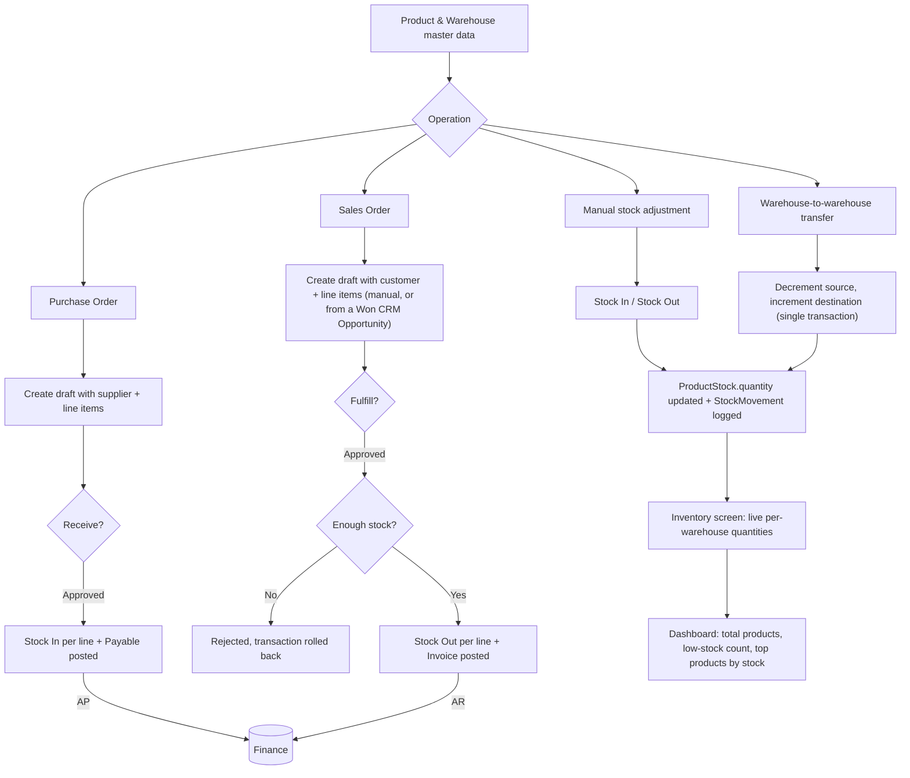
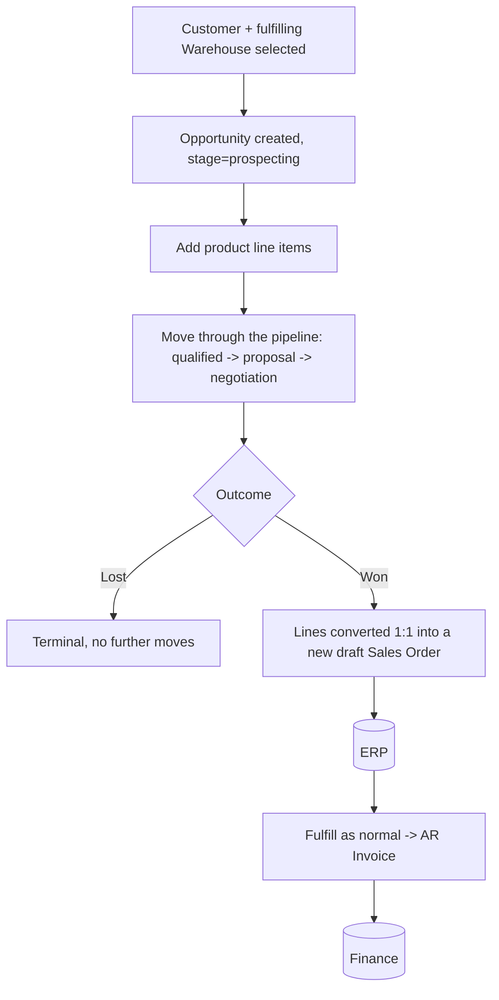
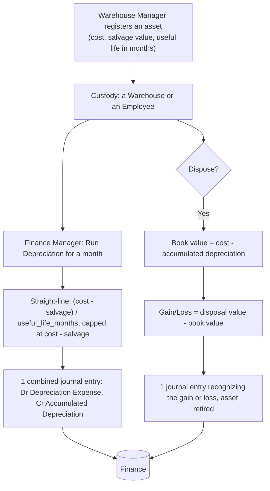
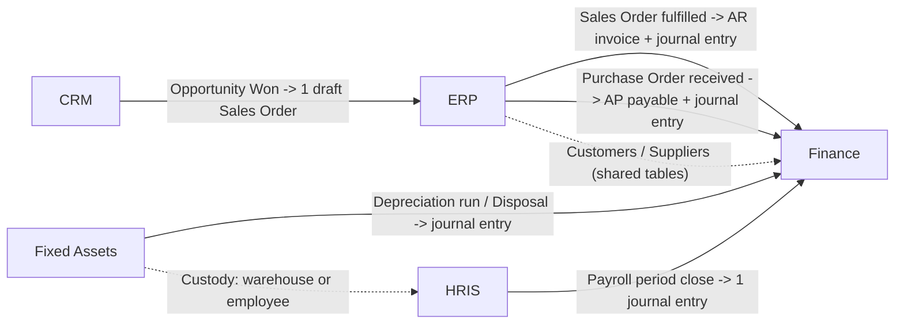

# MENTER

**HRIS · Finance · ERP · CRM, one integrated business platform.**

MENTER is a single Laravel + Inertia.js + Vue 3 application that runs Human Resources, Accounting, Enterprise Resource Planning, a sales CRM, and a Fixed Assets register for a small/medium business out of one codebase and one database. An employee record, a journal entry, a warehouse stock movement, a sales opportunity, and a depreciating laptop never turn into five separate systems that drift out of sync.

This README is the single source of truth for the project. It covers what exists, how the pieces fit together, and how to run, test, and extend it. Everything documented here was read directly from the source code, migrations, routes, and seeders, not assumed. Detailed reference material lives in [`docs/`](docs/) and is linked from the relevant section below.

**Version 2.0** adds three things on top of the original HRIS/Finance/ERP core: a **CRM** module (sales pipeline that converts into a Sales Order), a **Fixed Assets** register (spanning HR custody, Finance depreciation/disposal, and ERP-adjacent physical tracking), and a richer **Training** module (course materials with a rich-text editor and embedded video, per-division scoping, and a recruitment screening gate that can block a candidate from being hired until they pass).

---

## Table of Contents

1. [Overview](#1-overview)
2. [System Goals](#2-system-goals)
3. [Features](#3-features)
4. [System Architecture](#4-system-architecture)
5. [Modules](#5-modules)
6. [Technology Stack](#6-technology-stack)
7. [Project Structure](#7-project-structure)
8. [Database & ERD](#8-database--erd)
9. [HRIS Flow](#9-hris-flow)
10. [Finance Flow](#10-finance-flow)
11. [ERP Flow](#11-erp-flow)
12. [CRM Flow](#12-crm-flow)
13. [Fixed Assets Flow](#13-fixed-assets-flow)
14. [HRIS ↔ Finance ↔ ERP ↔ CRM ↔ Assets Integration](#14-hris--finance--erp--crm--assets-integration)
15. [Role & Permission](#15-role--permission)
16. [Role Action Flow](#16-role-action-flow)
17. [Business Process](#17-business-process)
18. [Authentication & Authorization](#18-authentication--authorization)
19. [Routes / API](#19-routes--api)
20. [Background Jobs / Events / Notifications](#20-background-jobs--events--notifications)
21. [Installation](#21-installation)
22. [Environment Configuration](#22-environment-configuration)
23. [Database Setup](#23-database-setup)
24. [Seeder / Initial Data](#24-seeder--initial-data)
25. [Running the Application](#25-running-the-application)
26. [Testing](#26-testing)
27. [Deployment](#27-deployment)
28. [Troubleshooting](#28-troubleshooting)
29. [Development Guidelines](#29-development-guidelines)
30. [Future Development](#30-future-development)
31. [Contribution Guidelines](#31-contribution-guidelines)

---

## 1. Overview

MENTER covers four business domains, plus a cross-cutting asset register, in one app:

- **HRIS**: employees, org structure, attendance, leave, overtime, payroll, KPIs, performance reviews, recruitment, training (with course materials and a recruitment screening gate).
- **Finance**: chart of accounts, double-entry journal, cash & bank, accounts receivable (invoices) and accounts payable (payables), financial reports.
- **ERP**: products, warehouses, multi-warehouse inventory, suppliers, customers, purchase orders, sales orders.
- **CRM**: a sales pipeline (Opportunities) that carries product line items and converts directly into a draft Sales Order when won.
- **Fixed Assets**: a physical asset register (laptops, vehicles, furniture, ...) whose custody is either a warehouse or an employee, and which depreciates and can be disposed of, each posting a real journal entry.

The domains aren't just grouped under one sidebar for looks. Closing a payroll period, fulfilling a sales order, receiving a purchase order, winning an opportunity, running monthly depreciation, and disposing of an asset each **automatically produce the correct downstream record** (a journal entry, a draft sales order, ...), so nobody has to re-enter the same transaction into another domain by hand after it already happened. See [§14](#14-hris--finance--erp--crm--assets-integration).

## 2. System Goals

These are read from what was actually built, not from a marketing brief:

- One login, one permission system, one database for HR, Accounting, Inventory/Order operations, the sales pipeline, and the asset register.
- Every financial effect of an HR, ERP, CRM, or Assets action (payroll, a fulfilled sale, a received purchase, a won opportunity, a depreciation run, a disposal) is captured as a real, balanced, double-entry journal entry where one applies. Never a derived number bolted on afterward.
- Role-based access down to the individual action (view vs. create vs. approve/manage) for every module.
- An audit trail for the sensitive Core/HRIS/CRM/Assets data: who changed what, and when (see [§8](#8-database--erd)).
- A demo-able system. One seed command produces a fully populated, realistic dataset across every domain (see [§24](#24-seeder--initial-data)).

## 3. Features

Grouped by domain. Every item below has a corresponding controller/service and is reachable from the sidebar for a role with the right permission.

**HRIS**
- Employee records (with manager hierarchy, department/position, soft-delete)
- Department & position management
- Attendance: self-service check-in/check-out with a configurable grace period, company-wide log for managers
- Leave: request, approve/reject/cancel, per-employee-per-year balance tracking, unpaid-leave support
- Overtime: request, approve/reject/cancel, daily hour cap
- Payroll: open a period, generate payslips, adjust line items (allowance/bonus/deduction), approve, close the period
- KPIs & Performance Reviews: weighted KPI scoring per review period
- Recruitment: vacancies, applicants, a stage pipeline, interview notes, convert to employee, and an optional **screening training gate** that blocks a move to Hired until an assigned recruitment program is passed
- Training: categories, programs scoped to one division or general (all divisions), course materials per program (rich-text lessons via an embedded editor, embedded YouTube/Vimeo video, uploaded documents with inline PDF preview), employee enrollment with completion tracking

**Finance**
- Chart of Accounts (asset/liability/equity/revenue/expense, with parent/sub-account support)
- Double-entry Journal Entries (manual, always validated to balance)
- Cash & Bank: live balances, income/expense quick-entry, inter-account transfer
- Invoices (AR) and Payables (AP): create, then mark paid; each posts its own journal entry
- Financial Reports: live Profit & Loss and Balance Sheet, computed from the ledger

**ERP**
- Products, Warehouses, multi-warehouse stock (`ProductStock`) with an append-only movement ledger (`StockMovement`)
- Manual stock adjustment (in/out) and inter-warehouse transfer, both concurrency-safe
- Suppliers & Customers (shared with Finance's AP/AR)
- Purchase Orders: draft, then receive (adds stock and posts a Payable)
- Sales Orders: draft, then fulfill (deducts stock and posts an Invoice)

**CRM**
- Opportunities: customer, fulfilling warehouse, title, source, expected close date, an optional assignee, and product line items
- A six-stage pipeline (Prospecting → Qualified → Proposal → Negotiation → Won/Lost), with Won/Lost as terminal states
- Marking an opportunity **Won** converts its line items 1:1 into a new draft Sales Order in ERP
- Notes per opportunity, same pattern as Recruitment's applicant notes

**Fixed Assets**
- A register of physical assets (equipment, vehicle, furniture, building, other), each with an acquisition cost, salvage value, and useful life in months
- Custody is either a Warehouse or an Employee; Warehouse Manager registers and reassigns, Finance Manager runs the financial actions
- Straight-line depreciation, run manually per month; posts one combined journal entry covering every eligible asset
- Disposal posts a single journal entry recognizing any gain or loss against book value, and retires the asset

**Platform**
- Role-based access control (9 roles, 31 permission modules, 75 permissions total, see [§15](#15-role--permission))
- Audit log for Core/HRIS/CRM/Assets models ([§8](#8-database--erd))
- Cross-domain Dashboard with live charts (attendance trend, leave status breakdown, cash flow, stock levels, CRM pipeline breakdown, asset book value)
- A consistent toast-notification and empty-state design system, searchable-combobox selects, password visibility toggles, dark mode

## 4. System Architecture



This is a classic **server-rendered SPA** (Inertia.js), not a decoupled API plus frontend. There's one deployable, the Vue app never talks to a separate JSON API, and there's no client-side router making REST calls. Every "page" is a Vue component rendered by Inertia from a Laravel controller response. See [§19](#19-routes--api) for why there's no `routes/api.php`.

## 5. Modules

| Domain | Sidebar section | Primary controllers | Primary services |
|---|---|---|---|
| Platform | Dashboard, Administration | `DashboardController`, `Admin\*` | *(none)* |
| HRIS | HRIS | `Hris\*` (14 controllers) | `AttendanceService`, `LeaveService`, `OvertimeService`, `PayrollService`, `PerformanceService`, `RecruitmentService`, `TrainingService` |
| Finance | Finance | `Finance\*` (6 controllers) | `JournalService`, `CashBankService`, `InvoiceService`, `PayableService` |
| CRM | CRM | `Crm\OpportunityController` | `OpportunityService` |
| ERP | ERP | `Erp\*` (7 controllers) | `InventoryService`, `PurchaseOrderService`, `SalesOrderService` |
| Fixed Assets | Assets | `AssetController` | `FixedAssetService` |

`AssetController` deliberately lives at `App\Http\Controllers\AssetController`, not under an `Assets\` sub-namespace like `Crm\`/`Erp\`, since it's a single controller rather than a small controller family. Full file listing: [§7](#7-project-structure).

## 6. Technology Stack

| Layer | Technology |
|---|---|
| Backend framework | Laravel 12 (PHP ^8.2, developed against 8.3) |
| Server-side rendering bridge | Inertia.js 2.0 (`inertiajs/inertia-laravel`) |
| Frontend | Vue 3.5 (Composition API, `<script setup>`) + TypeScript |
| Build tool | Vite 6 |
| Styling | Tailwind CSS 3.4 + `tailwindcss-animate`, CSS-variable-based design tokens (emerald/slate theme, light and dark mode) |
| UI primitives | `radix-vue` (headless components like Dialog and Checkbox), `lucide-vue-next` (icons), `class-variance-authority` + `tailwind-merge` for variant styling |
| Rich text | `@tiptap/vue-3` + `@tiptap/starter-kit`, `@tiptap/extension-link`, `@tiptap/extension-placeholder` for the Training material text editor; `dompurify` sanitizes the resulting HTML before it's ever rendered with `v-html` |
| Route sharing | `tightenco/ziggy`. The `@routes` Blade directive inlines every named Laravel route into the page, so Vue components can call `route('finance.invoices.store')` the same way Blade would |
| Authorization | `spatie/laravel-permission` ^8.3 (roles and permissions, no custom Policy classes) |
| API tokens (installed, unused) | `laravel/sanctum` ^4.3 |
| Database | MySQL (dev/prod), SQLite in-memory for automated tests |
| Testing | PHPUnit 11 via `php artisan test` (Pest is present as a dev dependency of the starter kit, but every test is written as a PHPUnit `TestCase` class) |
| Code style | Laravel Pint (PHP), ESLint + Prettier (`prettier-plugin-tailwindcss`) for TS/Vue |
| Charts | Hand-built inline SVG Vue components (`resources/js/components/charts/`), no charting library dependency |

## 7. Project Structure

```text
app/
  Concerns/Auditable.php        # audit-log trait, mixed into 25 models
  Enums/                        # status/type enums (AttendanceStatus, LeaveStatus, OpportunityStage,
                                 # AssetCategory, TrainingAudience, TrainingMaterialType, ScreeningResult, ...)
  Http/Controllers/
    Admin/                      # Users, Roles, Audit Log
    Auth/                       # Breeze/Fortify-style auth controllers (Laravel starter kit)
    Hris/                       # 14 controllers: employees, attendance, leave, overtime, payroll, kpis,
                                 # performance, recruitment, training, departments, positions
    Finance/                    # 6 controllers: accounts, journal, cash & bank, invoices, payables, reports
    Crm/                        # 1 controller: OpportunityController
    Erp/                        # 7 controllers: products, warehouses, inventory, suppliers, customers,
                                 # purchase orders, sales orders
    Settings/                   # profile, password
    AssetController.php         # Fixed Assets (top-level, not namespaced)
    DashboardController.php
  Models/                       # 46 Eloquent models, one per table (see docs/database.md)
  Services/                     # business logic; the only layer allowed to mutate financial/inventory state
database/
  migrations/                   # 56 migration files, chronologically ordered
  seeders/                      # one seeder per domain + DatabaseSeeder orchestrator
  factories/
resources/
  css/app.css                   # design tokens (CSS custom properties) + Tailwind layers + rich-text-content styles
  js/
    pages/                      # one Vue file per Inertia route, mirrors routes/*.php structure
    layouts/                    # AppLayout (authenticated shell), AuthLayout (login/register)
    components/
      RichTextEditor.vue        # Tiptap-based editor used by Training's text material type
      ui/                       # shadcn-vue-style primitives (Button, Input, Dialog, SearchableSelect, ...)
      charts/                   # TrendAreaChart, GroupedBarChart, HorizontalBarChart
routes/
  web.php                       # entry point; requires the files below
  hris.php  finance.php  crm.php  erp.php  assets.php  settings.php  auth.php
tests/
  Feature/{Admin,Assets,Auth,Crm,Dashboard,Erp,Finance,Hris,Settings}/
docs/                           # this file's detail pages (database, roles, business process, routes)
```

## 8. Database & ERD

Full entity-relationship diagrams (split by domain, since one diagram for all ~50 tables would be unreadable), every column, and the audit-trail coverage list:

**→ [docs/database.md](docs/database.md)**

Quick summary: Core/Auth (users, roles, permissions, audit log) feeds into HRIS (org structure, attendance, leave, payroll, performance, recruitment, training and its materials), Finance (accounts, journal, invoices, payables), ERP (products, warehouses, stock, orders), CRM (opportunities and their lines/notes), and Fixed Assets (the asset register and its depreciation history). The tables that physically cross domains are listed in [docs/database.md#cross-domain-foreign-keys](docs/database.md#cross-domain-foreign-keys).

## 9. HRIS Flow



A couple of things this flow deliberately does **not** cover: there's no dedicated resignation/termination workflow beyond setting `employment_status` on the employee record (the possible values come from the `EmploymentStatus` enum), and payroll doesn't currently deduct pay for unpaid leave taken. See [§30](#30-future-development).

## 10. Finance Flow



Who does what: an invoice or payable is **created** by Finance Staff or a Manager (`invoice.create` / `payable.manage`), but only a **Manager-level** permission (`invoice.approve` / `payable.manage`) can mark it paid. The exact permission-to-action mapping is in [§15](#15-role--permission). A manual journal entry has no separate approval step; creating it *is* posting it (`journal.approve` is seeded as a permission but not yet wired to any route, see [§30](#30-future-development)).

## 11. ERP Flow



Master data (`Product`, `Warehouse`, `Supplier`, `Customer`) has no approval workflow. Only the transactional documents (Purchase Order, Sales Order) go through a draft-then-approved-action state machine, and in both cases the "approval" (`purchase.approve` / `sales.approve`) is the same action that executes the operation (receive / fulfill). There's no separate "approve, then someone else executes" step.

## 12. CRM Flow



Only Sales Staff and Super Admin can create/manage opportunities (`opportunity.manage`); Finance Manager gets `opportunity.view` only, for pipeline/forecast visibility with no manage buttons rendered in the UI. See [§15](#15-role--permission).

## 13. Fixed Assets Flow



Registering and reassigning an asset (`asset.create`, Warehouse Manager) and posting its financial actions (`asset.manage`, Finance Manager) are deliberately split across two permissions and two roles. See [§15](#15-role--permission).

## 14. HRIS ↔ Finance ↔ ERP ↔ CRM ↔ Assets Integration



This is the full picture. **There is no reverse flow** (Finance doesn't push data back into HRIS, ERP, CRM, or Assets) and **no direct HRIS↔ERP link** at all beyond Fixed Assets' custody relationship. Full sequence diagrams (who calls what service, in what order, inside which transaction), the integration table (source, destination, data, trigger, mechanism), and the failure-handling model live here:

**→ [docs/business-process.md](docs/business-process.md)**

## 15. Role & Permission

9 roles, 31 permission modules, 75 permissions total, all defined in `database/seeders/RolePermissionSeeder.php`. Condensed view:

| Role | Full access to | Read-only / partial |
|---|---|---|
| Super Admin | Everything | *(none)* |
| HR Manager | Employees, Departments, Positions, Attendance, Leave, Overtime, KPIs, Performance, Recruitment, Training, Audit Log (view) | Users (view), Payroll (view + process, not approve) |
| HR Staff | *(none)* | Employee (view/create/update, no delete), Department/Position (view), Attendance (manage), Leave/Overtime (view/create, no approve), Training (view) |
| Finance Manager | Accounts, Journal, Cash & Bank, Income, Expense, Invoices, Payables, Fixed Assets (financial actions) | Reports (view), Payroll (view + approve), CRM Opportunities (view) |
| Finance Staff | Cash & Bank, Income, Expense | Accounts (view), Journal (view/create), Invoices (view/create), Payables (view) |
| Warehouse Manager | Warehouses, Inventory, Fixed Assets (custodial actions) | Products (view) |
| Purchasing Staff | *(none)* | Purchase Orders (view/create, no approve), Suppliers/Products/Inventory (view) |
| Sales Staff | Sales Orders (create/view, no approve), CRM Opportunities | Customers/Products/Inventory (view) |
| Employee | *(none)* | Own Attendance/Leave/Overtime/Payroll/Training only (self-service) |

Full permission catalogue, the complete role × permission matrix, and per-role action-flow diagrams:

**→ [docs/roles-and-permissions.md](docs/roles-and-permissions.md)**

## 16. Role Action Flow

Every role's login-to-module-to-allowed-actions flow, including what each role is explicitly *denied*, is diagrammed in **[docs/roles-and-permissions.md#role-action-flows](docs/roles-and-permissions.md#role-action-flows)**.

## 17. Business Process

Step-by-step sequence diagrams for the processes that matter most (Sales Order to Invoice, Purchase Order to Payable, Payroll close to Journal Entry, Leave request to approval, Opportunity Won to Sales Order, Fixed Asset depreciation/disposal to Journal Entry, and Recruitment screening to the hiring gate), plus how audit logging actually fires (a synchronous Eloquent-event trait, not a queue):

**→ [docs/business-process.md](docs/business-process.md)**

## 18. Authentication & Authorization

- **Authentication**: Laravel's session-based auth (the Vue starter kit's auth scaffold): login, registration, password reset, email verification, password confirmation. See `routes/auth.php` and `app/Http/Controllers/Auth/`.
- **Session storage**: database driver (`SESSION_DRIVER=database`).
- **Authorization**: `spatie/laravel-permission`. No custom Gate/Policy classes exist; every check is either the `permission:` route middleware or an inline `$request->user()->can('...')` in a controller. See [§15](#15-role--permission) for the full model, and [docs/roles-and-permissions.md](docs/roles-and-permissions.md) for why UI-level permission checks (hiding a button) are a convenience rather than the actual security boundary.
- **Shared frontend auth state**: the `HandleInertiaRequests` middleware shares `auth.user`, `auth.permissions` (a flat array), and `auth.roles` on every Inertia response. That's what Vue components read to decide what to render.
- **Self-service scoping**: an `Employee` role user doesn't get a *different* permission per record. The controller resolves `Auth::user()->employee` and scopes queries to that employee's `id`, so "Employee" permissions are visibility-limited by the same permission a manager has rather than by a separate ACL.

## 19. Routes / API

MENTER exposes **web routes only** (Inertia), not a JSON REST API. The complete route table, every URI, HTTP verb, route name, and the exact permission it requires, is here:

**→ [docs/routes.md](docs/routes.md)**

`laravel/sanctum` is installed and `User` has `HasApiTokens`, but no `routes/api.php` exists and nothing issues a token today (see [§30](#30-future-development)).

## 20. Background Jobs / Events / Notifications

**None are implemented.** `app/Jobs`, `app/Events`, `app/Listeners`, and `app/Notifications` don't exist in this codebase, and there are no `Console\Commands` beyond the framework default. `QUEUE_CONNECTION=database` and the `jobs` table are only present because they ship with the default Laravel skeleton; nothing dispatches a job.

Every "process" that might look like a background job (audit logging, payroll posting, invoice/payable creation, a Fixed Assets depreciation run) actually runs **synchronously inside the HTTP request**, wrapped in a `DB::transaction()`. Depreciation in particular is a manually-triggered "Run Depreciation" button rather than a scheduled job, a deliberate choice to keep this the first and only new pattern rather than also introducing a scheduler; see [docs/business-process.md#failure-handling--retries](docs/business-process.md#failure-handling--retries) for why synchronous processing is a deliberate simplicity choice, and [§30](#30-future-development) for where a queue/scheduler would first make sense.

## 21. Installation

### Requirements

| Requirement | Version used in development | Notes |
|---|---|---|
| PHP | 8.3 | `composer.json` requires `^8.2` minimum |
| Composer | 2.x | |
| Node.js | 22.x | `^20` or `^22` recommended for Vite 6 |
| npm | 10.x | |
| Database | MySQL 8.x | SQLite is used automatically for tests only, see [§26](#26-testing) |

No Redis, no queue worker, and no external service is required to run the app (see [§20](#20-background-jobs--events--notifications)).

### Steps

```bash
git clone <repository-url>
cd hris-finance-erp

composer install
npm install

cp .env.example .env
php artisan key:generate

# Create the database first (see §23), then:
php artisan migrate --seed

npm run build
php artisan serve
```

Log in at the URL `php artisan serve` prints, using any account from [§24](#24-seeder--initial-data). The password is `password` for all of them.

## 22. Environment Configuration

Only the variables a developer actually needs to touch. The full list is in `.env.example`; **no real secrets are committed there** (every value is blank, a safe default, or `localhost`).

| Variable | Description | Required |
|---|---|---|
| `APP_NAME` | Displayed app name and browser title (currently `MENTER`) | Yes |
| `APP_ENV` | `local` / `production` | Yes |
| `APP_KEY` | Generated by `php artisan key:generate`, never set by hand | Yes |
| `APP_URL` | Base URL used for generated links (e.g. password reset emails) | Yes |
| `DB_CONNECTION` | `mysql` (default) | Yes |
| `DB_HOST`, `DB_PORT` | Database host/port | Yes |
| `DB_DATABASE` | Database name (`.env.example` ships `nexa`, an earlier project name; rename it freely, nothing in the code depends on it) | Yes |
| `DB_USERNAME`, `DB_PASSWORD` | Database credentials | Yes |
| `SESSION_DRIVER` | `database` (default), requires the `sessions` table created by the base migration | Yes |
| `QUEUE_CONNECTION` | `database` (default), present but unused, see [§20](#20-background-jobs--events--notifications) | Conditional |
| `MAIL_MAILER` | `log` in development (mail gets written to the log instead of sent) | Conditional |
| `VITE_APP_NAME` | Mirrors `APP_NAME` into the frontend build | Yes |

## 23. Database Setup

```bash
# Create an empty database matching your .env DB_DATABASE value, then:
php artisan migrate
```

56 migrations run in chronological order (see [docs/database.md](docs/database.md) for what each one creates). A few of them are intentional "add column to an existing table" migrations (`add_manager_id_to_departments_table`, `add_is_cash_bank_to_accounts_table`, `add_invoice_and_payable_links`, `add_journal_entry_id_to_payroll_periods_table`, `add_department_and_audience_to_training_programs_table`). They exist because the referenced table didn't exist yet when the base table was first created, or because a later feature (division scoping, recruitment-vs-staff audience) needed a new column on an existing table (see the note in [docs/database.md](docs/database.md#hris-domain)), not because of a later schema mistake.

Two tables have a unique-key name shortened by hand (`applicant_training_results_unique`) because MySQL's default auto-generated index name for that column pair exceeds its 64-character identifier limit; functionally identical to Laravel's default naming, just shorter.

## 24. Seeder / Initial Data

```bash
php artisan migrate --seed
# or, on an existing database:
php artisan db:seed
```

`DatabaseSeeder` runs, in this order: `RolePermissionSeeder`, then `HrisSeeder` (10 departments, 40 to 90 employees at 4 to 9 per department), `AttendanceSeeder` (20 weekdays of realistic present/late/absent history), `LeaveTypeSeeder`, `KpiSeeder`, `RecruitmentSeeder`, **9 demo user accounts** (one per role), `TrainingSeeder` (categories/programs including a division-scoped one and course materials, plus a `recruitment`-audience screening program applied to two in-pipeline applicants), `LeaveRequestSeeder` (around 49 leave requests across 4 months, covering every status), `ChartOfAccountsSeeder` (20 accounts, including the new Fixed Assets/depreciation/disposal accounts, plus 6 months of income/expense journal history), `PayrollSeeder` (closed periods with real payslips and journal entries), `ErpSeeder` (2 warehouses, 8 products with varied stock levels, 2 suppliers, 2 customers), `SalesOrderSeeder` (fulfilled + draft demo orders), `OpportunitySeeder` (opportunities across every pipeline stage, including one Won that produced a real Sales Order), and finally `FixedAssetSeeder` (6 assets across categories and custody, two months of posted depreciation, and one full disposal with a realized loss).

**Demo accounts** (password `password` for all):

| Email | Role |
|---|---|
| `admin@nexa.test` | Super Admin |
| `hr.manager@nexa.test` | HR Manager |
| `hr.staff@nexa.test` | HR Staff |
| `finance.manager@nexa.test` | Finance Manager |
| `finance.staff@nexa.test` | Finance Staff |
| `warehouse.manager@nexa.test` | Warehouse Manager |
| `purchasing.staff@nexa.test` | Purchasing Staff |
| `sales.staff@nexa.test` | Sales Staff |
| `employee@nexa.test` | Employee |

`php artisan migrate:fresh --seed` drops and recreates everything. Use it whenever you want a clean, fully-populated demo dataset.

## 25. Running the Application

Development mode needs two processes running side by side, since Inertia's dev experience relies on Vite's HMR server alongside PHP:

```bash
php artisan serve      # Laravel dev server, defaults to http://127.0.0.1:8000
npm run dev             # Vite dev server with HMR
```

Production-style local run (single process, pre-built assets):

```bash
npm run build
php artisan serve
```

> **Windows/WSL note**: Vite's dev server binds to `[::1]` (IPv6 loopback) by default. If a headless browser or tool can't reach `http://localhost:5173`, either use the "production-style" run above or point the tool at `http://127.0.0.1:5173` explicitly after confirming Vite actually listens on IPv4 in your environment.

## 26. Testing

```bash
php artisan test
```

This runs the full PHPUnit suite (107 tests at the time of writing) across `tests/Feature/{Admin,Assets,Auth,Crm,Dashboard,Erp,Finance,Hris,Settings}`. Tests run against an **in-memory SQLite database**, so no separate test database setup is required.

Coverage is intentionally focused rather than exhaustive (see the testing philosophy in [§29](#29-development-guidelines)): each Service class gets 2 to 7 tests covering its core business rule, things like "an unbalanced journal entry is rejected", "fulfilling beyond available stock is rejected", "closing a period posts a payroll journal entry", "a passed screening allows hiring but a pending one blocks it", or "disposing an asset posts a balanced gain/loss entry", instead of trying to cover every edge case of every controller.

```bash
php artisan test --filter=JournalTest   # run one test class
vendor/bin/pint                          # PHP code style, should pass clean before committing
npm run format                           # Prettier, auto-formats resources/
npm run lint                             # ESLint --fix for TS/Vue
npm run build                            # also acts as a Vue/TypeScript compile check
```

These are the same four commands `lint.yml` and `tests.yml` run in CI (see [§27](#27-deployment)). Running them locally before pushing saves you a red check on the PR.

## 27. Deployment

**Continuous Integration** runs on GitHub Actions (`.github/workflows/`) on every push or PR to `main` or `develop`:

| Workflow | Steps |
|---|---|
| `tests.yml` | Set up PHP 8.4 and Node 22, `npm ci`, create a SQLite file, `composer install`, copy `.env`, `php artisan key:generate`, `php artisan ziggy:generate` (refreshes the TypeScript route types), `npm run build`, `./vendor/bin/phpunit` |
| `lint.yml` | Set up PHP 8.4, `composer install` and `npm install`, `vendor/bin/pint`, `npm run format`, `npm run lint` |

There's **no CD (automatic deployment) step**. Both workflows only verify the code; neither one deploys it. No Dockerfile or infrastructure-as-code is committed either, so getting the app onto an actual server is a manual process. A standard Laravel deployment applies:

```text
Development (local, SQLite for tests, MySQL for app)
   ↓
Build:   composer install --no-dev --optimize-autoloader
         npm ci && npm run build
   ↓
Release: php artisan migrate --force
         php artisan config:cache && php artisan route:cache && php artisan view:cache
   ↓
Serve:   Nginx/Apache + PHP-FPM, document root at /public
```

Notes specific to this app:

- No queue worker (e.g. Supervisor running `php artisan queue:work`) is needed, see [§20](#20-background-jobs--events--notifications).
- No Redis is required. Sessions and cache both default to the `database` driver.
- The build step (`npm run build`) has to run before every deploy. Inertia's root Blade view (`resources/views/app.blade.php`) reads the Vite manifest, and it'll throw a 500 if the manifest is missing and the dev server isn't running either.
- Uploaded training documents are stored on the `public` disk (`storage/app/public`, symlinked via `php artisan storage:link`); a real deployment needs that symlink created (or the disk swapped for S3-compatible storage) or those files 404.

## 28. Troubleshooting

```text
Problem:  "Vite manifest not found" error on any page
Cause:    npm run build was never run, and the Vite dev server isn't running either
Solution: Run `npm run build` for a production-style run, or `npm run dev` alongside
          `php artisan serve` for local development.
```

```text
Problem:  A page loads with no styling / blank body, only in an automated/headless browser
Cause:    Vite's dev server binds to [::1] (IPv6) by default; some headless environments
          can't resolve that
Solution: Stop the dev server, delete public/hot if present, run `npm run build`, and let
          Laravel serve the compiled assets from public/build instead.
```

```text
Problem:  Database connection failed
Cause:    .env DB_* values don't match a database that actually exists
Solution: Confirm DB_HOST, DB_PORT, DB_DATABASE, DB_USERNAME, DB_PASSWORD, and that the
          database itself was created before running `php artisan migrate`.
```

```text
Problem:  Creating an Invoice or Payable throws "No query results for model [Account]"
Cause:    InvoiceService/PayableService (and FixedAssetService, for depreciation/disposal)
          look up specific accounts by their seeded code, and those need to exist.
Solution: Run `php artisan db:seed --class=ChartOfAccountsSeeder` (or a full `db:seed`)
          before using AR/AP or Fixed Assets features on a database that skipped seeding.
```

```text
Problem:  Fulfilling a Sales Order or receiving a Purchase Order fails validation
Cause:    Fulfilling checks live stock via InventoryService and rejects insufficient
          quantity; both also require at least one revenue/expense account of the right
          type to exist for the auto-posted Invoice/Payable.
Solution: Check stock levels on the Inventory screen, and confirm the Chart of Accounts
          has at least one `revenue` and one `expense` account.
```

```text
Problem:  Moving a Recruitment applicant to "Hired" fails validation
Cause:    The applicant has an assigned screening training (an `applicant_training_results`
          row) whose result is still Pending or Failed. This is by design, see §9/§17.
Solution: Open the applicant's Screening Training card and record a Pass, or unassign the
          screening if it shouldn't be required for that vacancy.
```

```text
Problem:  An embedded YouTube video shows YouTube's own "Video unavailable" message
Cause:    That specific video's owner has disabled embedding (a per-video YouTube setting,
          not a bug in the app). Check with the YouTube oEmbed endpoint
          (https://www.youtube.com/oembed?url=<video-url>&format=json) before seeding or
          linking a video; a non-embeddable video still opens fine via its "Watch on
          YouTube" link inside the player.
Solution: Use a video the uploader has allowed to be embedded.
```

```text
Problem:  A demo account can log in but sees an almost-empty Dashboard/sidebar
Cause:    That role genuinely has few permissions (Sales Staff, for example, has no
          Finance access at all beyond CRM). This is by design, not a bug. See §15.
Solution: Log in as a role with broader access (Super Admin, HR Manager, Finance
          Manager) to see the full picture, or check docs/roles-and-permissions.md
          for exactly what that role can see.
```

## 29. Development Guidelines

Conventions this codebase actually follows. Read these before adding a feature:

- **Business logic lives in `app/Services/*`, never in a controller.** Every service method that mutates state wraps its work in `DB::transaction()` and uses `lockForUpdate()` on rows it reads then writes (see `InventoryService`, `LeaveService`, `PayrollService`, `OpportunityService`, or `FixedAssetService` for the pattern). Controllers validate the request, call one service method, and redirect or render. Nothing more.
- **Money is `decimal`, never `float`, in the database and in Eloquent casts.** Journal entry debit/credit, product price, payroll amounts, asset costs: all `decimal:2`.
- **Double-entry is enforced in one place**, `JournalService::create()`. If a feature needs to post a financial transaction, it should call this service (directly, or through `InvoiceService`, `PayableService`, or `CashBankService`, which all wrap it) rather than inserting `journal_entries`/`journal_entry_lines` rows itself. `FixedAssetService` follows the same rule.
- **Cross-database date comparisons must use `whereDate()`**, not a raw `where('date', ...)`. The app runs on MySQL (a real `DATE` column, which truncates time) in development but SQLite (which stores whatever string was inserted) in tests, so a raw comparison that works on one can silently break on the other. This has bitten the project once already; don't reintroduce it.
- **Frontend permission checks are UX only.** Always add the matching `permission:` middleware (or `abort_unless`) on the server side. Never rely on a hidden button as the actual access control.
- **Keep tests lean.** 2 to 7 focused tests per service covering the actual business rule, not exhaustive coverage. That's an explicit project preference, not an oversight (see `tests/Feature/*`).
- **New selects use `SearchableSelect`** (`resources/js/components/ui/select/SearchableSelect.vue`), not the plain HTML `<select>`. Every existing page has already been converted.
- **Money/date formatting on the frontend** goes through `Intl.NumberFormat('id-ID', { style: 'currency', currency: 'IDR', ... })`. The app is Indonesian-Rupiah-denominated throughout, so don't introduce a second currency format.
- **Rich-text HTML is always sanitized before `v-html`.** `RichTextEditor.vue` produces HTML; any page that renders it (currently Training's material viewer) runs it through `DOMPurify.sanitize()` first, never trusts it directly. If a future feature adds another rich-text field, follow the same rule.
- **Splitting a "physical/custodial" action from a "financial" action across two permissions is the established pattern for anything that touches both** (Fixed Assets: `asset.create` vs `asset.manage`; ERP orders: `purchase.create`/`sales.create` vs `.approve`). Prefer this over one broad permission when a new feature has the same shape.

## 30. Future Development

Split honestly between **Planned** (a clear, scoped next step) and **Limitation** (a known gap with no committed timeline):

**Planned**
- Wire `journal.approve` to an actual draft-then-approve workflow for manual journal entries (the permission is seeded but currently unused; journal entries post immediately on create).
- Bring the ERP domain (`Product`, `Warehouse`, `ProductStock`, `StockMovement`, `Supplier`, `Customer`, `PurchaseOrder`, `SalesOrder`) and Finance's AR/AP tables (`Invoice`, `Payable`) under the `Auditable` trait, matching Core/HRIS/CRM/Assets coverage.
- A REST API surface using the already-installed Sanctum, for a future mobile client or third-party integration.
- Let a Purchase Order line optionally originate a Fixed Asset directly (a capital-purchase flag), instead of registering assets only through the standalone Assets screen.

**Limitations (known, not hidden)**
- No resignation/termination workflow beyond manually changing `employment_status`.
- Payroll doesn't deduct pay for unpaid leave taken in the period.
- No budget module, multi-currency support, or tax calculation anywhere in Finance.
- No background job/queue infrastructure is actually used, so payroll generation for a very large employee count, and a Fixed Assets depreciation run across a very large asset register, both run synchronously inside one request. Fine at the current seeded scale; a queued job would make sense somewhere in the hundreds-to-thousands range for either.
- Fixed Assets depreciation has no scheduler; a real deployment needs someone to click "Run Depreciation" every month. This was a deliberate choice to avoid introducing the first cron/queue infrastructure in the app for one feature; see [docs/business-process.md](docs/business-process.md).
- Training video materials are embed links only (YouTube/Vimeo); there's no video file upload/hosting, since self-hosting large video files on local disk isn't a good fit for this app's storage model.
- CI (GitHub Actions) verifies the code on every push, but there's no CD step, Dockerfile, or infrastructure-as-code, so deployment itself is still a manual process (see [§27](#27-deployment)).

## 31. Contribution Guidelines

This is a solo-developed portfolio/internal project without an external contribution process, but if you're extending it:

1. Follow the conventions in [§29](#29-development-guidelines), especially "business logic in Services" and "double-entry through `JournalService`".
2. Run `vendor/bin/pint`, `npm run lint`, and `php artisan test` before committing. All three should pass clean.
3. Keep new tests focused (2 to 7 per service) rather than exhaustive, matching the existing suite's style.
4. Update the relevant file under `docs/` (and this README's summary section) whenever a change adds or removes a route, permission, table, or cross-domain integration. The goal is for this documentation to never drift from the code that actually runs.
5. Never commit real credentials into `.env.example` or anywhere else in the repository.
