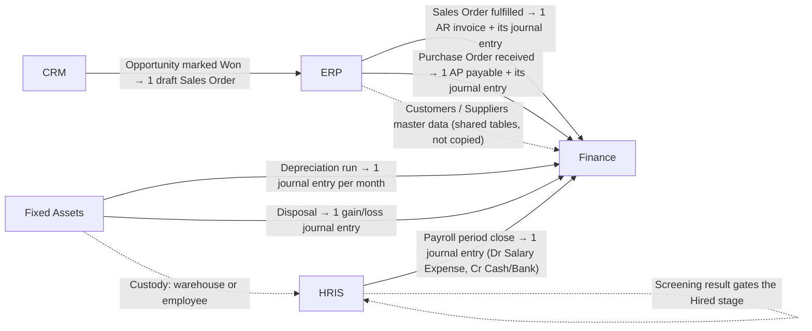
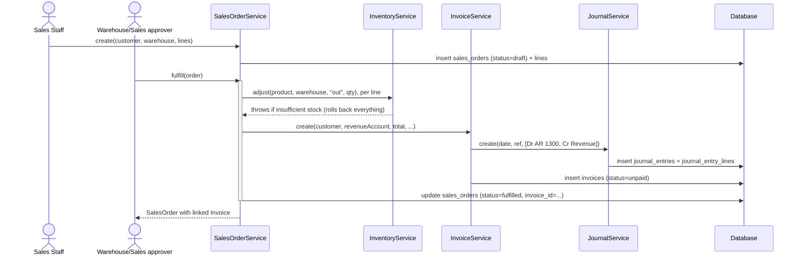
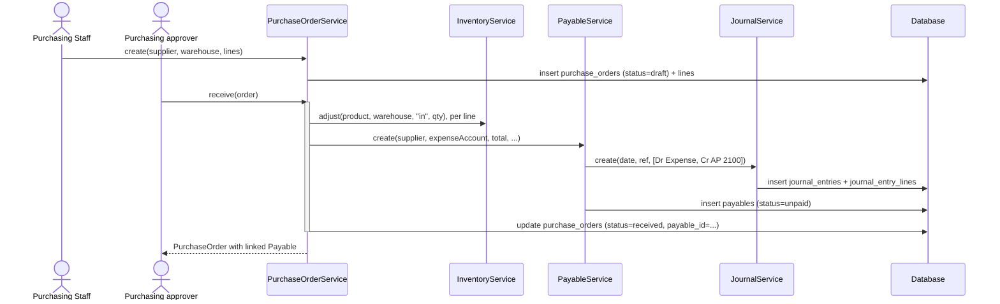
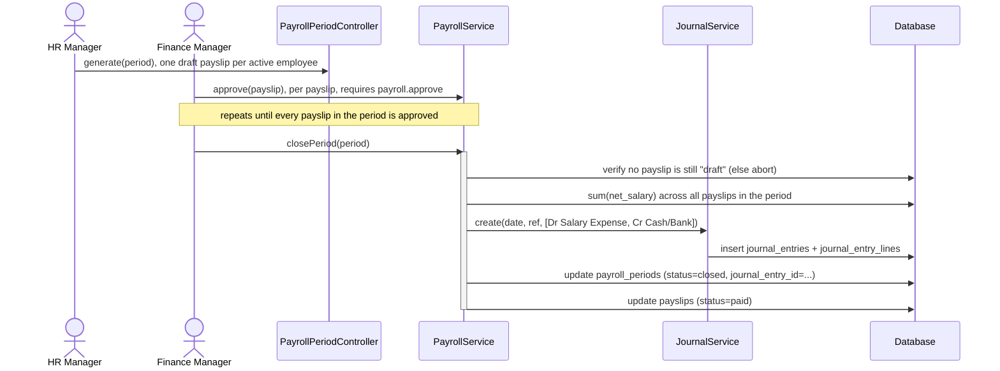
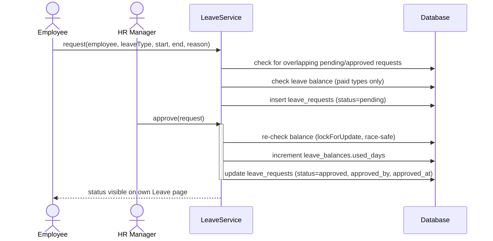
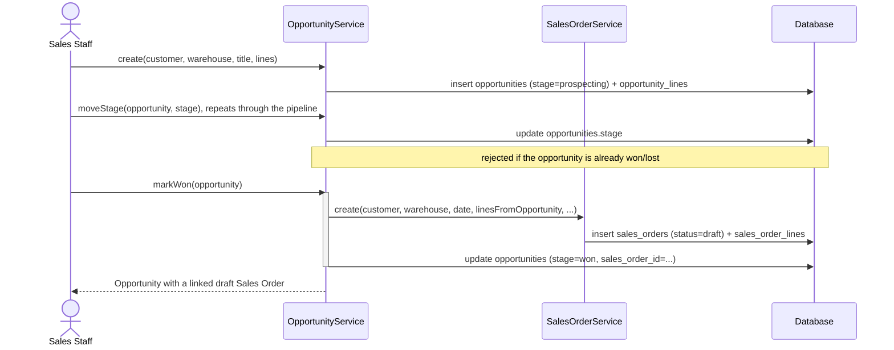
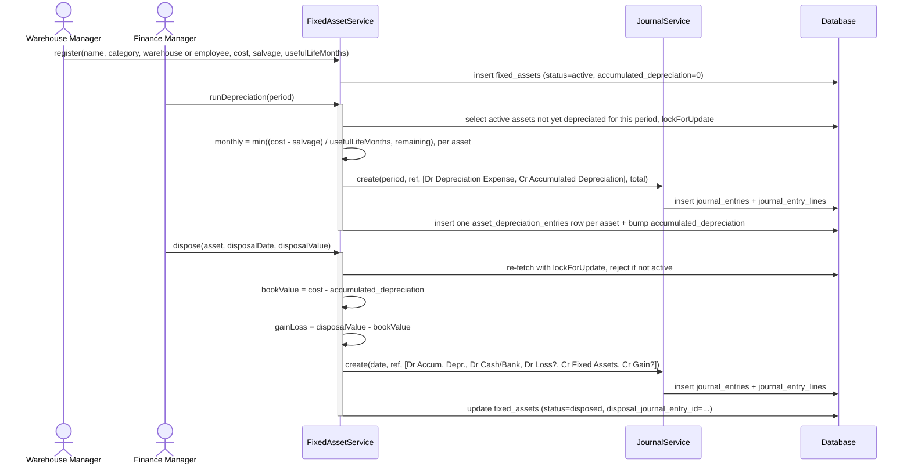
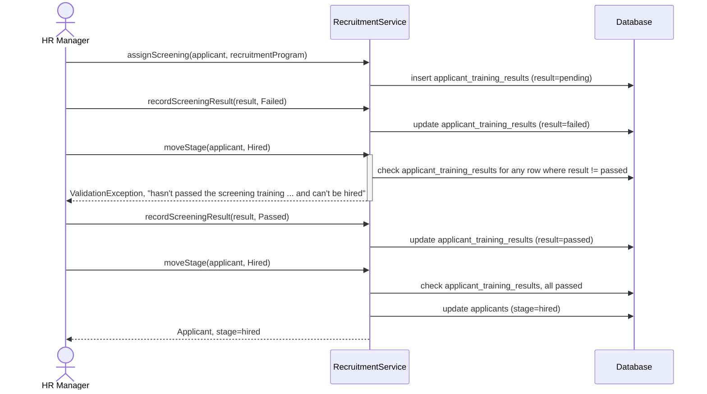

# Business Process & Integration

[← Back to README](../README.md)

This document covers the cross-cutting flows: how HRIS, Finance, and ERP hand data to each other, and the step-by-step business processes that matter most (payroll to journal, sales fulfillment to invoice, purchase receipt to payable, leave approval). Every diagram and claim here traces back to a specific Service class method, with no speculative flows.

## Contents

- [Integration: HRIS ↔ Finance ↔ ERP ↔ CRM ↔ Assets](#integration-hris--finance--erp--crm--assets)
- [Integration table](#integration-table)
- [Sequence: Sales Order fulfillment → AR Invoice](#sequence-sales-order-fulfillment--ar-invoice)
- [Sequence: Purchase Order receipt → AP Payable](#sequence-purchase-order-receipt--ap-payable)
- [Sequence: Payroll period close → Journal Entry](#sequence-payroll-period-close--journal-entry)
- [Sequence: Leave request → approval](#sequence-leave-request--approval)
- [Sequence: Opportunity Won → Sales Order](#sequence-opportunity-won--sales-order)
- [Sequence: Fixed Asset depreciation & disposal → Journal Entry](#sequence-fixed-asset-depreciation--disposal--journal-entry)
- [Sequence: Recruitment screening → hiring gate](#sequence-recruitment-screening--hiring-gate)
- [Audit logging](#audit-logging)
- [Failure handling & retries](#failure-handling--retries)

---

## Integration: HRIS ↔ Finance ↔ ERP ↔ CRM ↔ Assets



This is the **complete** set of automated, code-level integrations that exist today. There is **no** live data flow in the reverse directions: Finance does not push balances back into ERP, HRIS, CRM, or Assets, and none of those domains read Finance data directly (the Dashboard reads every domain independently for display, which is not the same as one domain integrating with another). The one intra-HRIS loop, Training's screening result gating Recruitment's Hired stage, is drawn as a self-loop because both sides live in the HRIS domain.

All integrations share the same mechanism: a **synchronous method call inside a database transaction**, not an event, queued job, or HTTP API call. There is no message queue, webhook, or async worker involved anywhere in this system (`app/Jobs`, `app/Events`, and `app/Listeners` do not exist in this codebase).

## Integration table

| Integration | Source | Destination | Data | Trigger | Mechanism |
|---|---|---|---|---|---|
| Payroll → Journal | HRIS (`PayrollPeriod` + `Payslip`) | Finance (`JournalEntry`) | Sum of `net_salary` across every payslip in the period, posted as one Dr Salary Expense / Cr Cash-or-Bank entry | `PayrollService::closePeriod()`, requires every payslip in the period to already be `approved` | Direct method call: `PayrollService` constructor-injects `JournalService` and calls `->create(...)` inside the same DB transaction that closes the period |
| Sales Order → Invoice (AR) | ERP (`SalesOrder`) | Finance (`Invoice` + `JournalEntry`) | Order total (`Σ quantity × unit_price`) becomes the invoice amount; invoice due 30 days out | `SalesOrderService::fulfill()`, after stock is deducted from the warehouse | Direct method call: `SalesOrderService` constructor-injects `InvoiceService`; `sales_orders.invoice_id` stores the resulting invoice's ID |
| Purchase Order → Payable (AP) | ERP (`PurchaseOrder`) | Finance (`Payable` + `JournalEntry`) | Order total becomes the payable amount; payable due 30 days out | `PurchaseOrderService::receive()`, after stock is added to the warehouse | Direct method call: `PurchaseOrderService` constructor-injects `PayableService`; `purchase_orders.payable_id` stores the resulting payable's ID |
| Opportunity Won → Sales Order | CRM (`Opportunity`) | ERP (`SalesOrder`) | `opportunity_lines` become the new order's lines 1:1 | `OpportunityService::markWon()` | Direct method call: `OpportunityService` constructor-injects `SalesOrderService`; `opportunities.sales_order_id` stores the resulting order's ID |
| Depreciation run → Journal | Assets (`FixedAsset`) | Finance (`JournalEntry`) | Sum of each eligible asset's capped monthly depreciation, posted as one Dr Depreciation Expense / Cr Accumulated Depreciation entry | `FixedAssetService::runDepreciation()`, manually triggered per month (no scheduler) | Direct method call: `FixedAssetService` constructor-injects `JournalService`; one `AssetDepreciationEntry` row per asset references the resulting entry |
| Disposal → Journal | Assets (`FixedAsset`) | Finance (`JournalEntry`) | Write off cost + accumulated depreciation, recognize gain or loss on the disposal value | `FixedAssetService::dispose()` | Direct method call through the same `JournalService`; `fixed_assets.disposal_journal_entry_id` stores the resulting entry |
| Screening result → Hiring gate | HRIS (`ApplicantTrainingResult`) | HRIS (`Applicant.stage`) | An applicant with any non-`passed` screening result cannot be moved to `hired` | `RecruitmentService::moveStage(..., Hired)` | In-process guard clause, no cross-service call; both sides are HRIS, this is the one integration that doesn't cross a domain boundary |
| Customer/Supplier master data | ERP (Sales Orders, Purchase Orders screens) | Finance (Invoices, Payables screens) | The `customers` and `suppliers` tables themselves: a single shared table each, not a sync | Whenever either domain reads/writes a customer or supplier | Shared database table (no data movement at all; both domains query the same rows) |
| Asset custody | Assets (`FixedAsset`) | HRIS (`Employee`) / ERP (`Warehouse`) | An asset's `employee_id`/`warehouse_id`, whichever is set | `FixedAssetService::register()`/`reassign()` | Shared foreign key, no data movement |
| Cash & Bank balance | Finance (`Account` where `is_cash_bank = true`) | Dashboard (all domains) | Live balance, computed on read | Every Dashboard page load | `Account::balance()` sums `journal_entry_lines` on demand, not a stored/cached value, so there is nothing to "sync" |

**Source of truth**: for revenue/expense/receivable/payable accounting, `journal_entries` + `journal_entry_lines` are always authoritative. Every balance shown anywhere in the app (Chart of Accounts, Cash & Bank, Reports, Dashboard) is computed live from these two tables via `Account::balance()`, never stored redundantly.

**Failure handling**: because every integration point runs inside the *same* `DB::transaction()` closure as the ERP/HRIS action that triggers it, a failure in the Finance half (e.g. a missing AR/AP account code, or `InventoryService` throwing "insufficient stock") rolls back the **entire** operation. A Sales Order is never left "fulfilled" with a missing invoice, and a Payroll period is never left "closed" without its journal entry. There is no partial-success or eventual-consistency state to reconcile, and consequently no retry mechanism exists or is needed: the user simply resubmits the action after fixing the underlying validation error.

---

## Sequence: Sales Order fulfillment → AR Invoice



Route: `POST /erp/sales-orders/{salesOrder}/fulfill`, gated by `sales.approve`.

## Sequence: Purchase Order receipt → AP Payable



Route: `POST /erp/purchase-orders/{purchaseOrder}/receive`, gated by `purchase.approve`.

## Sequence: Payroll period close → Journal Entry



Route: `POST /hris/payroll/periods/{period}/generate` (generation) and the payslip approve/period close actions under `routes/hris.php`, gated by `payroll.process` / `payroll.approve`.

## Sequence: Leave request → approval

A representative **HRIS-only** business process (no Finance/ERP crossover; payroll does *not* currently deduct for unpaid leave taken):



Unpaid leave types (`is_paid = false`) skip the balance check entirely. There is no cap on unpaid leave in this system.

---

## Sequence: Opportunity Won → Sales Order



Route: `POST /crm/opportunities/{opportunity}/win`, gated by `opportunity.manage`. The resulting Sales Order is a normal **draft**; fulfilling it (and therefore posting the AR invoice) is a separate action on the ERP side, same as any manually-created order.

## Sequence: Fixed Asset depreciation & disposal → Journal Entry



Routes: `POST /assets` (`asset.create`), `POST /assets/depreciation-runs` and `POST /assets/{asset}/dispose` (both `asset.manage`). Registering/reassigning an asset (the custody side) and running depreciation/disposing it (the financial side) are deliberately gated by different permissions, held by different roles; see [Roles & Permissions](roles-and-permissions.md).

## Sequence: Recruitment screening → hiring gate



Routes: `POST /hris/recruitment/applicants/{applicant}/training` and `.../training/{result}` (both `recruitment.manage`), `POST /hris/recruitment/applicants/{applicant}/stage` for the move itself. **The gate is opt-in**: an applicant with no `applicant_training_results` row at all is never blocked, so vacancies that don't use a screening program behave exactly as they did before this feature existed.

---

## Audit logging

Not a queued/background process. It runs **synchronously, in-process**, as part of the same request that saves the model:

```text
Trigger:  Eloquent `created` / `updated` / `deleted` event fires on any model using the Auditable trait
Process:  Auditable::bootAuditable() listener runs, diffs old vs. new attributes (updates only),
          strips password/remember_token/updated_at
Data:     One row written to `audit_logs`: user_id (from Auth::id()), action, auditable_type,
          auditable_id, old_values (json), new_values (json), ip_address, user_agent
Output:   Visible at /admin/audit-logs (gated by `audit.view`)
Failure:  None specific. If the audit insert fails, it fails as part of the same request/transaction
          as the original save (no separate retry path, because there is no separate process)
```

See [Database → Soft deletes & audit trail](database.md#soft-deletes--audit-trail) for exactly which models are covered.

## Failure handling & retries

Because there are no queues, jobs, or external service calls anywhere in this codebase, "failure handling" in MENTER is entirely about **transactional integrity within a single request**:

- Every multi-step write (approve, close period, fulfill, receive, adjust stock, post a journal entry) is wrapped in `DB::transaction()`.
- Business-rule violations (insufficient stock, unbalanced journal, insufficient leave balance, wrong status transition) throw a Laravel `ValidationException`, which Inertia surfaces back to the originating form as a field error. The transaction rolls back automatically, so the database never reflects a half-applied action.
- There is no automatic retry, no dead-letter queue, and no eventual consistency anywhere. Every action is either fully applied or not applied at all, resolved within the HTTP request/response cycle.
