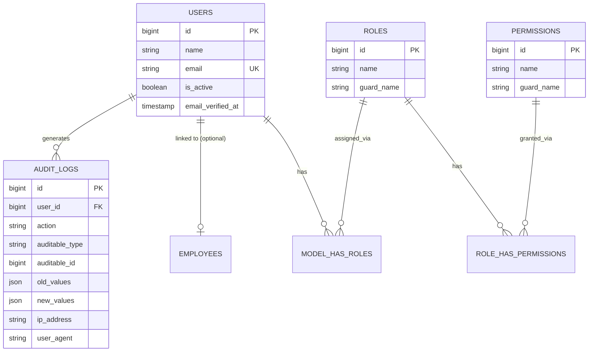
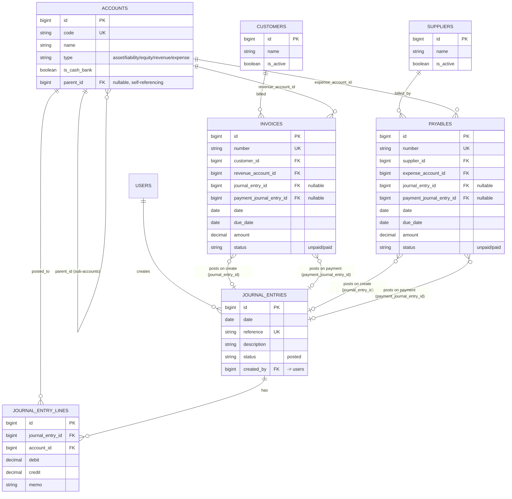
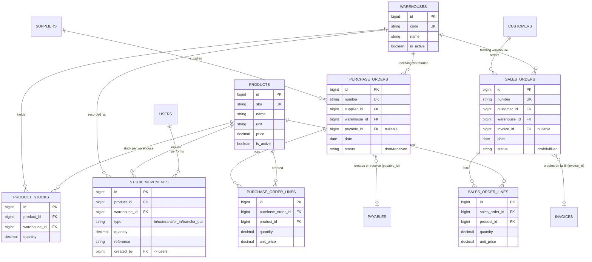
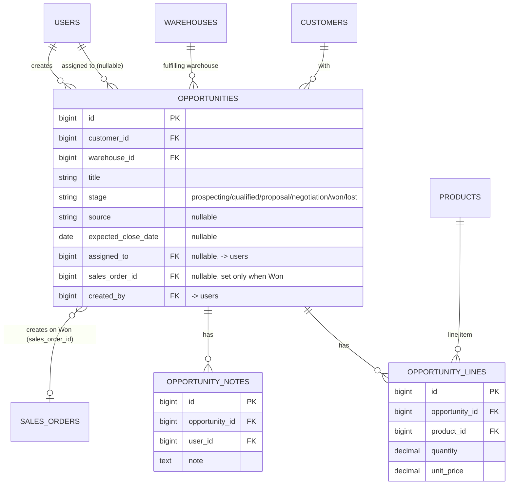
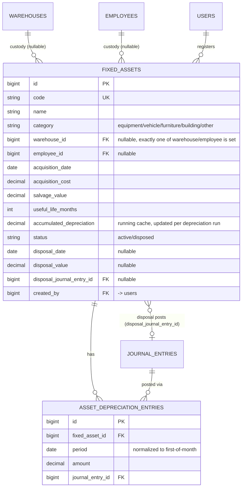

# Database & ERD

[← Back to README](../README.md)

MENTER uses a single relational database (MySQL in production/development, SQLite in-memory for the automated test suite). All tables are created through Laravel migrations under `database/migrations/`, and this document mirrors what those migrations actually create. Every column, key, and cardinality below was read directly from the migration files, not assumed.

Every entity has an auto-increment `id` primary key and `created_at`/`updated_at` timestamps unless noted otherwise; these are omitted from the diagrams for readability.

## Contents

- [Core / Authentication](#core--authentication)
- [HRIS domain](#hris-domain)
- [Finance domain](#finance-domain)
- [ERP domain](#erp-domain)
- [CRM domain](#crm-domain)
- [Fixed Assets](#fixed-assets)
- [Cross-domain foreign keys](#cross-domain-foreign-keys)
- [Soft deletes & audit trail](#soft-deletes--audit-trail)

---

## Core / Authentication

Users, role-based access control (Spatie `laravel-permission`), and the audit trail.

`MODEL_HAS_ROLES`, `MODEL_HAS_PERMISSIONS`, and `ROLE_HAS_PERMISSIONS` are the standard polymorphic pivot tables published by `spatie/laravel-permission` (migration `2026_08_28_021045_create_permission_tables.php`), not custom tables. See [Roles & Permissions](roles-and-permissions.md) for the full permission matrix, and `app/Concerns/Auditable.php` for how `AUDIT_LOGS` rows are written (a model trait, not a queued job, see [Business Process](business-process.md#audit-logging)).

`personal_access_tokens` (Sanctum) also exists in the schema for future API token support, but no route in the app currently issues or consumes one. See [Routes & API](routes.md).

---

## HRIS domain

Organizational structure, attendance, leave, overtime, payroll, KPIs, performance reviews, recruitment, and training.

```mermaid
erDiagram
    DEPARTMENTS ||--o{ POSITIONS : has
    DEPARTMENTS ||--o{ EMPLOYEES : has
    DEPARTMENTS }o--o| EMPLOYEES : "managed_by (manager_id)"
    POSITIONS ||--o{ EMPLOYEES : has
    EMPLOYEES }o--o| EMPLOYEES : "reports_to (manager_id)"
    EMPLOYEES ||--o| USERS : "self-service login"

    EMPLOYEES ||--o{ ATTENDANCES : records
    EMPLOYEES ||--o{ LEAVE_BALANCES : has
    EMPLOYEES ||--o{ LEAVE_REQUESTS : submits
    LEAVE_TYPES ||--o{ LEAVE_BALANCES : defines
    LEAVE_TYPES ||--o{ LEAVE_REQUESTS : defines
    EMPLOYEES ||--o{ OVERTIME_REQUESTS : submits

    PAYROLL_PERIODS ||--o{ PAYSLIPS : generates
    EMPLOYEES ||--o{ PAYSLIPS : receives
    PAYSLIPS ||--o{ PAYSLIP_ITEMS : has
    PAYROLL_PERIODS }o--o| JOURNAL_ENTRIES : "posts (journal_entry_id)"

    KPI_CATEGORIES ||--o{ KPIS : groups
    PERFORMANCE_PERIODS ||--o{ PERFORMANCE_REVIEWS : scopes
    EMPLOYEES ||--o{ PERFORMANCE_REVIEWS : reviewed_in
    PERFORMANCE_REVIEWS ||--o{ PERFORMANCE_REVIEW_ITEMS : has
    KPIS ||--o{ PERFORMANCE_REVIEW_ITEMS : scored_against

    DEPARTMENTS ||--o{ VACANCIES : opens
    POSITIONS ||--o{ VACANCIES : for
    VACANCIES ||--o{ APPLICANTS : receives
    APPLICANTS ||--o{ APPLICANT_NOTES : has

    TRAINING_CATEGORIES ||--o{ TRAINING_PROGRAMS : groups
    DEPARTMENTS }o--o| TRAINING_PROGRAMS : "scoped to (nullable, null = general)"
    TRAINING_PROGRAMS ||--o{ TRAINING_ENROLLMENTS : has
    EMPLOYEES ||--o{ TRAINING_ENROLLMENTS : enrolls
    TRAINING_PROGRAMS ||--o{ TRAINING_MATERIALS : contains
    TRAINING_PROGRAMS ||--o{ APPLICANT_TRAINING_RESULTS : "used as screening for"
    APPLICANTS ||--o{ APPLICANT_TRAINING_RESULTS : "takes (recruitment audience only)"

    DEPARTMENTS {
        bigint id PK
        string name
        string code UK
        bigint manager_id FK "nullable, -> employees"
    }
    POSITIONS {
        bigint id PK
        bigint department_id FK
        string name
        string code UK
        decimal salary_min
        decimal salary_max
    }
    EMPLOYEES {
        bigint id PK
        string employee_number UK
        bigint user_id FK "nullable, unique"
        bigint department_id FK
        bigint position_id FK
        bigint manager_id FK "nullable, self-referencing"
        string employment_type
        string employment_status
        decimal basic_salary
        date join_date
        timestamp deleted_at "soft delete"
    }
    ATTENDANCES {
        bigint id PK
        bigint employee_id FK
        date date
        datetime check_in_at
        datetime check_out_at
        string status "present/late/absent/leave/permission/holiday"
    }
    LEAVE_TYPES {
        bigint id PK
        string name
        string code UK
        smallint default_days_per_year
        boolean is_paid
    }
    LEAVE_BALANCES {
        bigint id PK
        bigint employee_id FK
        bigint leave_type_id FK
        smallint year
        decimal allocated_days
        decimal used_days
    }
    LEAVE_REQUESTS {
        bigint id PK
        bigint employee_id FK
        bigint leave_type_id FK
        date start_date
        date end_date
        decimal days
        string status "pending/approved/rejected/cancelled"
        bigint approved_by FK "nullable, -> users"
    }
    OVERTIME_REQUESTS {
        bigint id PK
        bigint employee_id FK
        date date
        decimal hours
        string status "pending/approved/rejected/cancelled"
        bigint approved_by FK "nullable, -> users"
    }
    PAYROLL_PERIODS {
        bigint id PK
        string name
        date start_date
        date end_date
        string status "open/closed"
        bigint journal_entry_id FK "nullable, -> journal_entries"
        bigint processed_by FK "nullable, -> users"
    }
    PAYSLIPS {
        bigint id PK
        bigint payroll_period_id FK
        bigint employee_id FK
        decimal basic_salary
        decimal overtime_amount
        decimal allowance_total
        decimal bonus_total
        decimal deduction_total
        decimal net_salary
        string status "draft/approved/paid"
    }
    PAYSLIP_ITEMS {
        bigint id PK
        bigint payslip_id FK
        string type "allowance/bonus/deduction"
        string label
        decimal amount
    }
    KPI_CATEGORIES {
        bigint id PK
        string name
    }
    KPIS {
        bigint id PK
        bigint kpi_category_id FK
        string name
        tinyint weight
    }
    PERFORMANCE_PERIODS {
        bigint id PK
        string name
        date start_date
        date end_date
        string status
    }
    PERFORMANCE_REVIEWS {
        bigint id PK
        bigint performance_period_id FK
        bigint employee_id FK
        bigint reviewer_id FK "-> users"
        string status "draft/submitted"
        decimal overall_score "nullable, weighted average"
    }
    PERFORMANCE_REVIEW_ITEMS {
        bigint id PK
        bigint performance_review_id FK
        bigint kpi_id FK
        tinyint score "0-100, nullable until scored"
    }
    VACANCIES {
        bigint id PK
        bigint department_id FK
        bigint position_id FK
        string title
        string status "open/closed"
    }
    APPLICANTS {
        bigint id PK
        bigint vacancy_id FK
        string name
        string email
        string stage "applied/screening/interview/assessment/offer/hired/rejected"
        date applied_at
    }
    APPLICANT_NOTES {
        bigint id PK
        bigint applicant_id FK
        bigint user_id FK
        text note
    }
    TRAINING_CATEGORIES {
        bigint id PK
        string name
    }
    TRAINING_PROGRAMS {
        bigint id PK
        bigint training_category_id FK
        bigint department_id FK "nullable, null = general/all divisions"
        string name
        string audience "staff/recruitment"
        string provider
        smallint duration_hours
    }
    TRAINING_ENROLLMENTS {
        bigint id PK
        bigint training_program_id FK
        bigint employee_id FK
        string status "enrolled/in_progress/completed/cancelled"
        date enrolled_at
        date completed_at
    }
    TRAINING_MATERIALS {
        bigint id PK
        bigint training_program_id FK
        string title
        string type "text/video/document"
        text body "nullable, rich-text HTML for type=text"
        string video_url "nullable, embed link for type=video"
        string file_path "nullable, uploaded file for type=document"
        int order
    }
    APPLICANT_TRAINING_RESULTS {
        bigint id PK
        bigint applicant_id FK
        bigint training_program_id FK
        string result "pending/passed/failed"
        bigint assessed_by FK "nullable, -> users"
        date assessed_at "nullable"
    }
```

Notes:

- `employees.manager_id` is self-referencing (an employee's manager is another employee) and `departments.manager_id` points to `employees`. The two tables were deliberately migrated in a way that avoids a circular foreign-key-at-creation problem: `departments` was created first without `manager_id`, then a follow-up migration adds it once `employees` exists.
- `employees.user_id` is nullable and unique. An employee **may** have a linked login (`users` row) for ESS (Employee Self-Service: check-in/out, own leave/overtime requests, own payslips, own performance reviews, training enrollment), but back-office-only employees can exist without one.
- `leave_balances` is unique per `(employee_id, leave_type_id, year)` and is created lazily the first time a balance is needed. There is no separate "allocate balances" step.
- `training_programs.department_id` is nullable: `null` means the program is general (visible to every employee); a non-null value scopes it to one division. `TrainingProgram::scopeVisibleTo($departmentId)` is the single query helper both the staff catalogue and the recruitment-screening picker reuse for this filter. A user with `training.manage` (HR Manager, Super Admin) always sees every program regardless of scope, for oversight.
- `training_programs.audience` splits the catalogue in two: `staff` programs are the normal enrollment catalogue; `recruitment` programs never appear there at all and are only reachable from an Applicant's detail page, as a screening test.
- `applicant_training_results` is unique per `(applicant_id, training_program_id)`. Recording a `passed`/`failed` result is what `RecruitmentService::moveStage()` checks before allowing a move to the `hired` stage: **if the applicant has any non-passed result row, the move is rejected.** An applicant with no screening assigned at all is unaffected, i.e. the gate is opt-in per applicant/vacancy, not a blanket requirement (see [Business Process](business-process.md#sequence-recruitment-screening--hiring-gate)).

---

## Finance domain

Chart of accounts, double-entry journal, cash & bank, and AR/AP.

Notes:

- Every financial transaction in the system (journal entries, invoices, payables, payroll postings, and ERP order postings) ultimately becomes rows in `journal_entries` + `journal_entry_lines`. `JournalService::create()` is the **only** place that writes to these tables, and it always enforces `SUM(debit) = SUM(credit)` with at least two lines (double-entry).
- `accounts.is_cash_bank` flags which asset accounts represent real cash/bank balances (seeded on Cash `1100` and Bank `1200`). The Cash & Bank screen, Dashboard, and the AR/AP "mark paid" flows all filter on this flag rather than hardcoding account codes.
- `AR (1300)` and `AP (2100)` account codes are looked up by code inside `InvoiceService`/`PayableService`, so they need to exist in the chart of accounts (seeded by `ChartOfAccountsSeeder`) for invoices/payables to work.

---

## ERP domain

Products, warehouses, inventory, suppliers/customers, and purchase/sales orders.

Notes:

- `product_stocks` is unique per `(product_id, warehouse_id)`. Stock is always warehouse-scoped, never a single global number.
- `stock_movements` is an append-only ledger. Current stock is always the sum of `product_stocks.quantity`, not derived from summing movements (both are kept in sync inside `InventoryService::adjust()`/`transfer()` in the same DB transaction).
- `customers` and `suppliers` are shared between the ERP screens (Purchase/Sales Orders) and the Finance screens (Invoices/Payables). There is one `customers` table and one `suppliers` table, not separate ERP/Finance copies.

---

## CRM domain

The sales pipeline: opportunities that convert into a Sales Order when won.

Notes:

- `stage` follows the same terminal-stage pattern as `applicants.stage`: once an opportunity reaches `won` or `lost`, `OpportunityService::moveStage()` rejects any further move.
- Marking an opportunity **Won** is the one CRM → ERP integration: `OpportunityService::markWon()` converts `opportunity_lines` 1:1 into a new draft `SalesOrder`'s lines (same `product_id`/`quantity`/`unit_price`), stores the resulting order's ID on `opportunities.sales_order_id`, and sets `stage = won`, all inside one transaction. See [Business Process](business-process.md#sequence-opportunity-won--sales-order).
- `opportunity_lines`/`opportunity_notes` mirror `sales_order_lines`/`applicant_notes` exactly in shape; this is deliberate reuse of an established pattern, not a new one.

## Fixed Assets

A physical asset register that spans all three domains: custody is either a `Warehouse` or an `Employee` (HR), depreciation posts to the ledger (Finance), and the register itself lives alongside ERP's warehouse-tracked physical goods.

Notes:

- Depreciation is straight-line: `monthly = (acquisition_cost - salvage_value) / useful_life_months`, capped so `accumulated_depreciation` never exceeds `acquisition_cost - salvage_value`. `FixedAssetService::runDepreciation()` posts **one combined journal entry** (`Dr Depreciation Expense, Cr Accumulated Depreciation`) covering every eligible asset for the month, mirroring how `PayrollService::closePeriod()` posts one entry for total net salary rather than one per employee.
- `asset_depreciation_entries` is unique per `(fixed_asset_id, period)`, so re-running depreciation for a month that's already posted is a no-op (the asset is simply excluded from that run) rather than a duplicate entry or an error.
- Disposal posts a single balanced entry recognizing gain or loss: `Dr Accumulated Depreciation, Dr Cash/Bank (proceeds), Dr Loss on Disposal (if any) / Cr Fixed Assets (original cost), Cr Gain on Disposal (if any)`. `JournalService::create()` drops the zero-amount legs automatically.
- New Chart of Accounts entries back this domain: `1500` Fixed Assets, `1510` Accumulated Depreciation (asset, contra), `5400` Depreciation Expense, `4200` Gain on Disposal of Assets, `5500` Loss on Disposal of Assets.

---

## Cross-domain foreign keys

These are the physical foreign keys that connect the three domains at the database level (see [Integration](business-process.md#integration-hris--finance--erp) for the full picture including the ones that are *not* physical FKs):

| From | To | Meaning |
|---|---|---|
| `payroll_periods.journal_entry_id` | `journal_entries.id` | Closing a payroll period posts one payroll journal entry (HRIS → Finance) |
| `sales_orders.invoice_id` | `invoices.id` | Fulfilling a sales order auto-creates an AR invoice (ERP → Finance) |
| `purchase_orders.payable_id` | `payables.id` | Receiving a purchase order auto-creates an AP payable (ERP → Finance) |
| `invoices.customer_id` / `payables.supplier_id` | `customers.id` / `suppliers.id` | Finance's AR/AP reuses ERP's customer/supplier master data |
| `employees.user_id` | `users.id` | HRIS employee records link to platform login accounts for ESS |
| `opportunities.sales_order_id` | `sales_orders.id` | Marking a CRM opportunity Won auto-creates a draft Sales Order (CRM → ERP) |
| `opportunities.warehouse_id` / `opportunity_lines.product_id` | `warehouses.id` / `products.id` | CRM reuses ERP's warehouse/product master data |
| `fixed_assets.employee_id` | `employees.id` | An asset's custody can be an employee (Assets → HRIS) |
| `asset_depreciation_entries.journal_entry_id` / `fixed_assets.disposal_journal_entry_id` | `journal_entries.id` | Depreciation runs and disposals post to the ledger (Assets → Finance) |
| `applicant_training_results.training_program_id` | `training_programs.id` | A recruitment-audience training program screens an applicant before hiring (HRIS-internal: Recruitment ↔ Training) |

There is **no** direct foreign key between HRIS and ERP proper (e.g. no employee-to-warehouse or employee-to-product link for the *core* HR/ERP tables). Fixed Assets is the one deliberate exception: it's a shared registry that HRIS (custody), Finance (depreciation/disposal postings), and ERP (warehouse-based custody, alongside physical goods) all touch directly. Otherwise the only HRIS↔ERP relationship is indirect, through shared `users`/roles (a Warehouse Manager is a `User`, not an `Employee`, unless a demo account happens to have both).

## Soft deletes & audit trail

- Only `employees` uses soft deletes (`deleted_at`). Every other table is hard-deleted (or, in practice, mostly never deleted from the UI at all; most screens only support create/update/status-transition).
- 25 of the ~46 models use the `Auditable` trait (`app/Concerns/Auditable.php`), which writes a row to `audit_logs` on every `created`/`updated`/`deleted` Eloquent event. It covers **Core and HRIS** models (`User`, `Employee`, `Department`, `Position`, `Attendance`, `LeaveRequest`, `LeaveBalance`, `LeaveType`, `OvertimeRequest`, `PayrollPeriod`, `Payslip`, `PayslipItem`, `Kpi`, `KpiCategory`, `PerformancePeriod`, `PerformanceReview`, `PerformanceReviewItem`, `Vacancy`, `Applicant`, `TrainingCategory`, `TrainingProgram`, `TrainingEnrollment`, `Account`, `JournalEntry`), plus the two top-level CRM/Assets records added since, `Opportunity` and `FixedAsset`. **Finance's newer AR/AP tables, the entire ERP domain (`Product`, `Warehouse`, `ProductStock`, `StockMovement`, `Supplier`, `Customer`, `PurchaseOrder`, `SalesOrder`, `Invoice`, `Payable`), and the line-item-style child tables everywhere (`OpportunityLine`, `OpportunityNote`, `AssetDepreciationEntry`, `TrainingMaterial`, `ApplicantTrainingResult`) do not currently use the trait**, so changes there are not captured in `audit_logs`. This is a known gap, not an oversight to hide. See [Future Development](../README.md#30-future-development).
