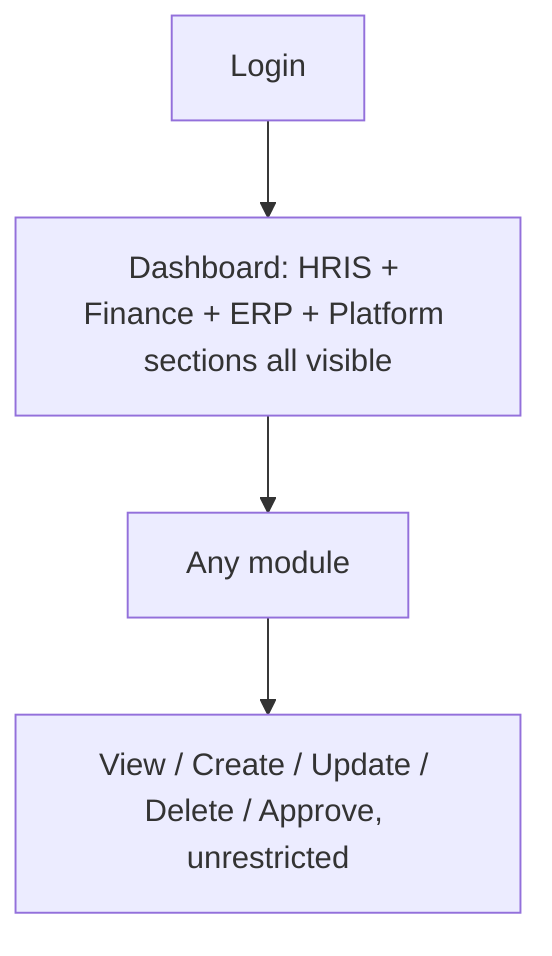
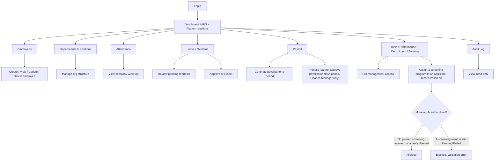
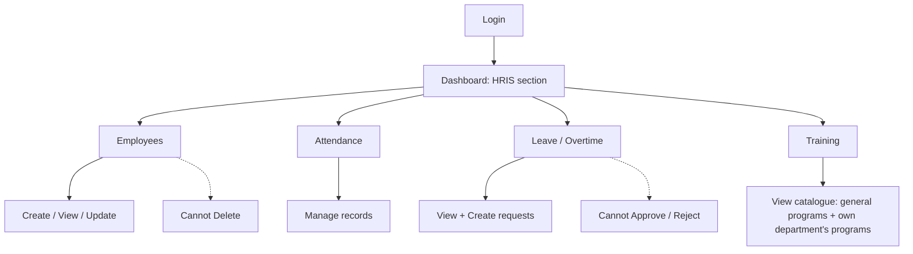
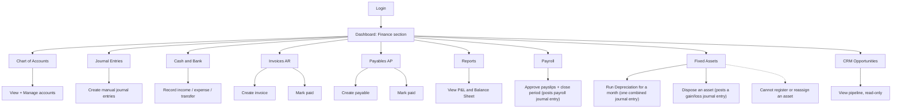
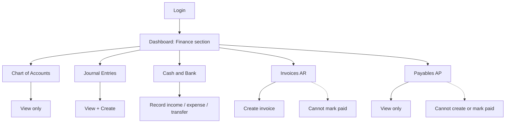
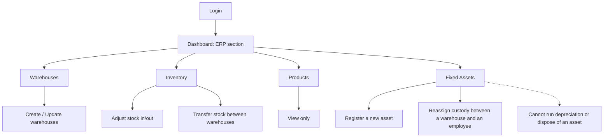
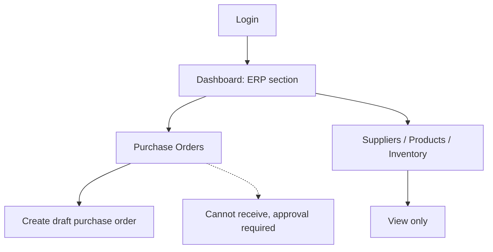
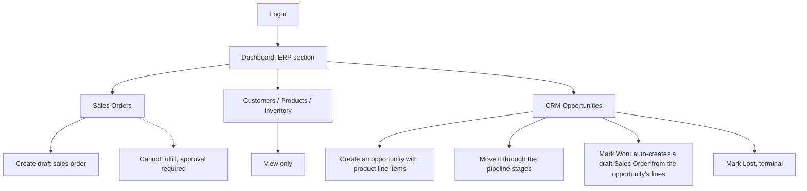
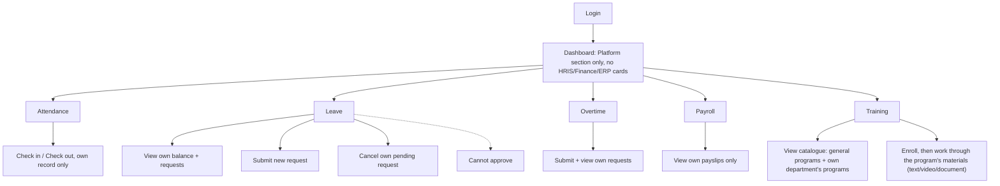

# Roles & Permissions

[← Back to README](../README.md)

Authorization is implemented with [`spatie/laravel-permission`](https://spatie.be/docs/laravel-permission). There are **no custom Policy classes** in the app (`app/Policies` does not exist), so every authorization check is either:

1. **Route-level**, via the `permission:` middleware alias (registered in `bootstrap/app.php`) applied per-route or per-resource-action in `routes/*.php`, or
2. **Controller-level**, via an explicit `abort_unless($request->user()->can('...'), 403)` call for actions that share a route with a view-only action (e.g. `store`/`update` inside a controller whose `index` only requires `.view`).

Frontend UI visibility mirrors this: `HandleInertiaRequests` shares `auth.permissions` (a flat array of permission names) on every request, and Vue pages/components read `page.props.auth.permissions.includes('...')` to conditionally render buttons/menu items. **This is a UX convenience only, not a security boundary.** The server-side `permission:` middleware and `abort_unless` checks are what actually enforce access; hiding a button does not, by itself, block the route.

All permissions and role assignments below are read directly from `database/seeders/RolePermissionSeeder.php`. Nothing here is inferred or aspirational.

## Contents

- [Permission catalogue](#permission-catalogue)
- [Roles](#roles)
- [Full role × permission matrix](#full-role--permission-matrix)
- [Role action flows](#role-action-flows)

---

## Permission catalogue

Permissions follow a `module.action` naming convention. 31 modules, 75 total permissions:

| Module | Actions | Used for |
|---|---|---|
| `users` | view, create, update, delete | Admin → User management |
| `roles` | view, create, update, delete | Admin → Roles & Permissions |
| `audit` | view | Admin → Audit Log |
| `employee` | view, create, update, delete | HRIS → Employees |
| `department` | view, manage | HRIS → Departments |
| `position` | view, manage | HRIS → Positions |
| `attendance` | view, manage | HRIS → Attendance |
| `leave` | view, create, approve | HRIS → Leave |
| `overtime` | view, create, approve | HRIS → Overtime |
| `payroll` | view, process, approve | HRIS → Payroll |
| `kpi` | view, manage | HRIS → KPIs |
| `performance` | view, manage | HRIS → Performance |
| `recruitment` | view, manage | HRIS → Recruitment |
| `training` | view, manage | HRIS → Training; `manage` covers program/category CRUD *and* course material (text/video/document) CRUD |
| `account` | view, manage | Finance → Chart of Accounts |
| `journal` | view, create, approve* | Finance → Journal Entries |
| `cashbank` | view, manage | Finance → Cash & Bank (transfers) |
| `income` | view, manage | Finance → Cash & Bank (record income) |
| `expense` | view, manage | Finance → Cash & Bank (record expense) |
| `invoice` | view, create, approve | Finance → Invoices (AR); `approve` gates "mark paid" |
| `payable` | view, manage | Finance → Payables (AP); `manage` covers create *and* mark-paid |
| `report` | view | Finance → Reports, and gates the Finance section of the Dashboard |
| `product` | view, manage | ERP → Products |
| `warehouse` | view, manage | ERP → Warehouses |
| `inventory` | view, adjust, transfer | ERP → Inventory |
| `supplier` | view, manage | ERP → Suppliers |
| `customer` | view, manage | ERP → Customers |
| `purchase` | view, create, approve | ERP → Purchase Orders; `approve` gates "receive" |
| `sales` | view, create, approve | ERP → Sales Orders; `approve` gates "fulfill" |
| `opportunity` | view, manage | CRM → Opportunities; `manage` covers create, stage moves, marking Won (which auto-creates a Sales Order), and notes |
| `asset` | view, create, manage | Assets → Fixed Assets; `create` is the physical-custody action (register, reassign), `manage` is the financial action (run depreciation, dispose) |

\* `journal.approve` is seeded as a permission but no route currently checks it. Journal entries post immediately on `journal.create` (there is no draft/approval workflow for manual journal entries). It exists for forward compatibility; see [Future Development](../README.md#30-future-development).

## Roles

9 roles are seeded, each mapped to one demo user (see [Installation → Demo accounts](../README.md#21-installation)):

| Role | Demo account | Intended persona |
|---|---|---|
| **Super Admin** | `admin@nexa.test` | Full access to every permission (`syncPermissions(Permission::all())`) |
| **HR Manager** | `hr.manager@nexa.test` | Full HRIS module control, read-only Users, payroll processing (not approval), audit log |
| **HR Staff** | `hr.staff@nexa.test` | Day-to-day HR data entry: employees (view/create/update, no delete), attendance management, leave/overtime request review |
| **Finance Manager** | `finance.manager@nexa.test` | Full Finance module control, reports, payroll viewing/approval, read-only CRM pipeline visibility, and the financial side of Fixed Assets (depreciation, disposal) |
| **Finance Staff** | `finance.staff@nexa.test` | Finance data entry: view accounts, create journal entries, manage cash/bank/income/expense, create invoices/view payables |
| **Warehouse Manager** | `warehouse.manager@nexa.test` | Full warehouse & inventory control, read-only Products, and the custodial side of Fixed Assets (register, reassign) |
| **Purchasing Staff** | `purchasing.staff@nexa.test` | Create purchase orders, view suppliers/products/inventory |
| **Sales Staff** | `sales.staff@nexa.test` | Create sales orders, view customers/products/inventory, and full control of the CRM Opportunities pipeline |
| **Employee** | `employee@nexa.test` | Employee self-service only: own attendance, own leave/overtime requests, own payroll, training catalogue |

Every demo account uses the password `password` (see `DatabaseSeeder::DEMO_USERS`).

## Full role × permission matrix

Generated from `RolePermissionSeeder::ROLE_PERMISSIONS`. `*` patterns (e.g. `employee.*`) are expanded to every permission under that module that exists in the catalogue above.

| Role | Module | Permissions granted |
|---|---|---|
| **Super Admin** | *(all)* | Every permission in the catalogue |
| **HR Manager** | users | `view` |
| | employee, department, position, attendance, leave, overtime, kpi, performance, recruitment, training | *(all actions)* |
| | payroll | `view`, `process` |
| | audit | `view` |
| **HR Staff** | employee | `view`, `create`, `update` |
| | department, position | `view` |
| | attendance | `manage` |
| | leave | `view`, `create` |
| | overtime | `view`, `create` |
| | training | `view` |
| **Finance Manager** | account, journal, cashbank, income, expense, invoice, payable | *(all actions)* |
| | report | `view` |
| | payroll | `view`, `approve` |
| | opportunity | `view` |
| | asset | `view`, `manage` |
| **Finance Staff** | account | `view` |
| | journal | `view`, `create` |
| | cashbank, income, expense | `manage` |
| | invoice | `view`, `create` |
| | payable | `view` |
| **Warehouse Manager** | warehouse, inventory | *(all actions)* |
| | product | `view` |
| | asset | `view`, `create` |
| **Purchasing Staff** | purchase | `view`, `create` |
| | supplier, product, inventory | `view` |
| **Sales Staff** | sales | `view`, `create` |
| | customer, product, inventory | `view` |
| | opportunity | *(all actions)* |
| **Employee** | attendance, payroll, training | `view` |
| | leave, overtime | `view`, `create` |

Notable gaps (by design, not omission):

- **No role except Super Admin, HR Manager, and Finance Manager can approve/reject leave or overtime, approve payroll, or approve invoices/purchase/sales orders that require the `.approve` suffix.** Approval authority is concentrated at the manager level.
- **Warehouse Manager, Purchasing Staff, and Sales Staff cannot see Finance data** (no `account.*`, `invoice.*`, `payable.*`), even though their actions (receiving a PO, fulfilling an SO) post Finance transactions behind the scenes. They see the operational side only.
- **HR Staff cannot delete employees** (`employee.delete` is HR Manager/Super Admin only) and **cannot approve leave/overtime** despite being able to view and create requests.
- **Fixed Assets deliberately splits custody from finance**: Warehouse Manager can register and reassign an asset but cannot run depreciation or dispose of it; Finance Manager can post those financial actions but cannot register a new asset. Neither can do the other's half alone. HR Manager gets no `asset.*` permission at all in this version, even though assets can be assigned to an employee; the HR link today is a data relationship (which employee has custody), not a permission surface.
- **CRM (Opportunities) is Sales Staff's domain end-to-end**; Finance Manager only gets `opportunity.view`, for pipeline/forecast visibility, with no manage buttons rendered in the UI.

## Role action flows

### Super Admin

### HR Manager

### HR Staff

### Finance Manager

### Finance Staff

### Warehouse Manager

### Purchasing Staff

### Sales Staff

### Employee (self-service)

Self-service scoping (an Employee only ever sees *their own* data, never a colleague's) is enforced in the controllers by resolving the current employee from `Auth::user()->employee` and scoping every query to `employee_id = $employee->id`. It's a query-level restriction inside the controller, not a separate permission per employee.
